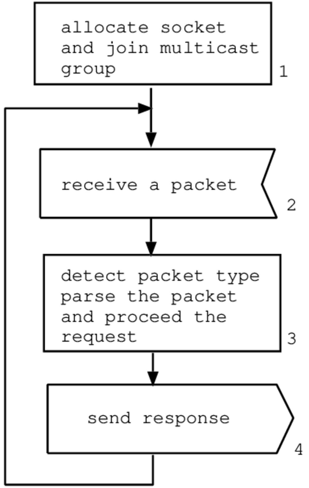
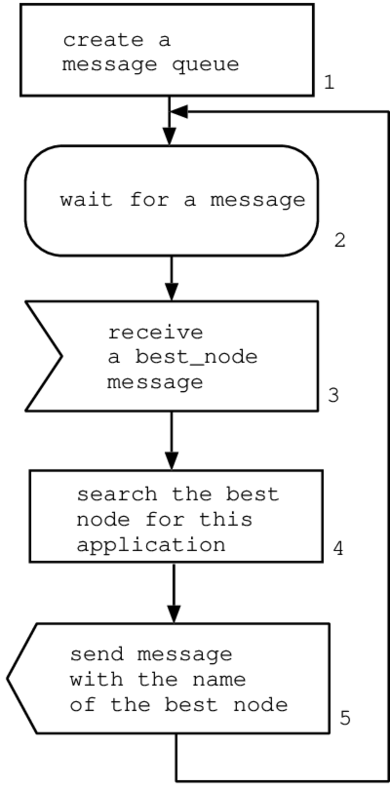
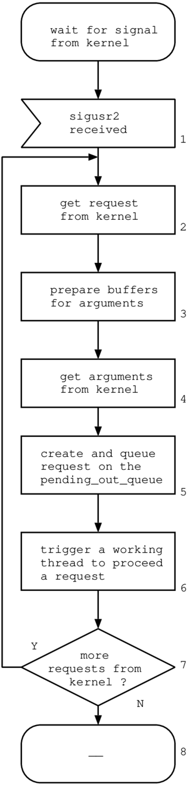
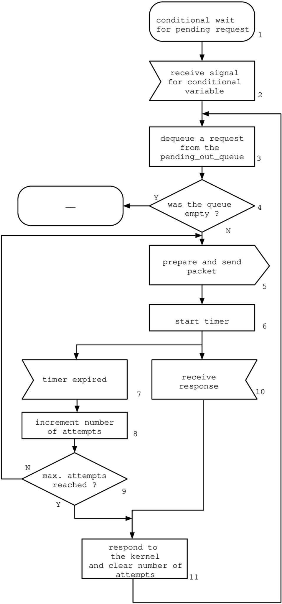
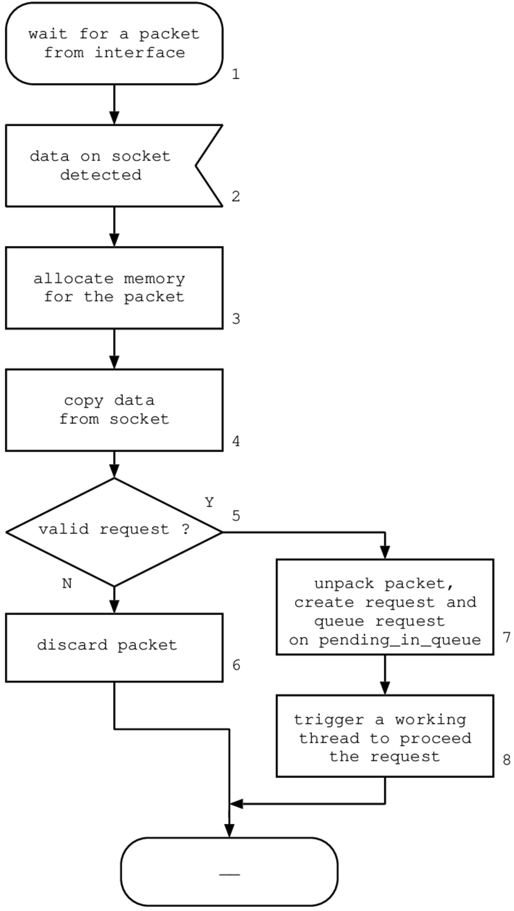
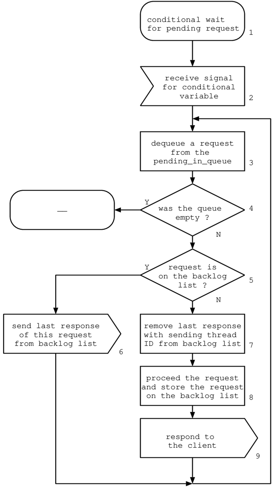
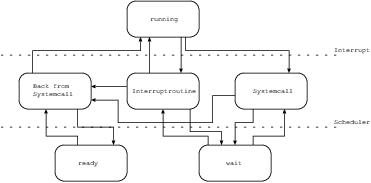
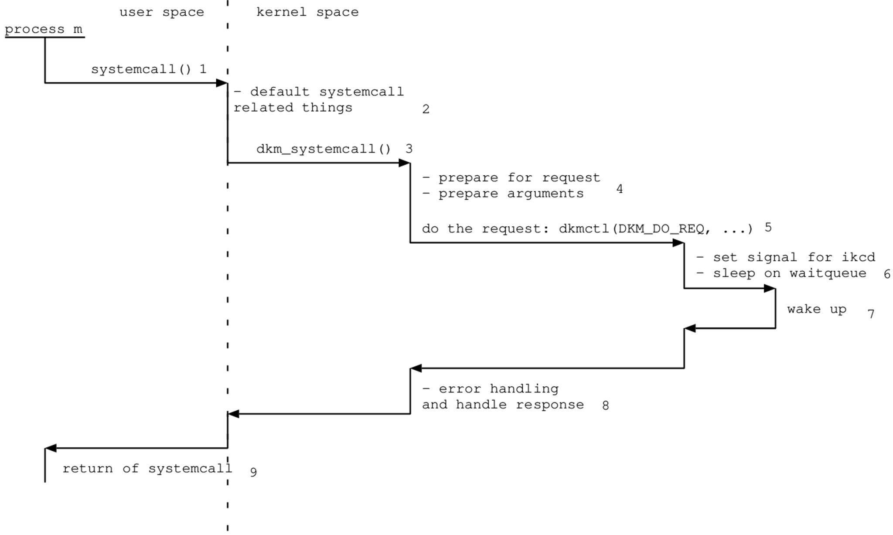
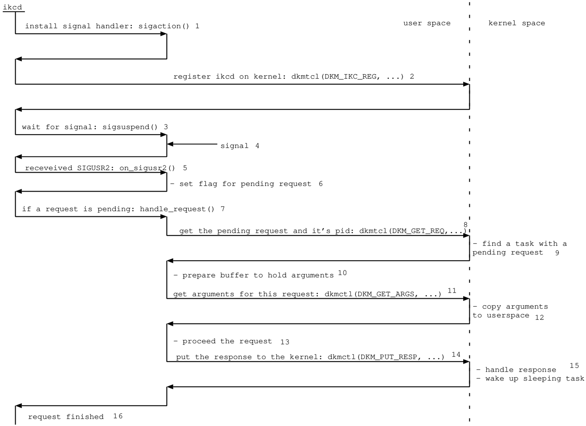

Diplomarbeit: 718/1999

Kunde: FHSO, Gianni N. Di Pietro

Betreuer FHSO: Rolf Schmutz

Experte: Georges Schild, Ascom

Autor: Marcel Lanz

Abgabe: 17. Dezember 1999

Version: 1.0

Definition von Begriffen
========================

DKM:

:   Distributed Kernel Multiprocessing ist eine Technologie, um Prozesse
    eines Rechners auf andere Rechner in einem Netz zu veteilen.

DKM-Knoten:

:   Ein Computer mit installiertem Linux und DKM-Support.

SMP:

:   Symmetrical Multi-Processing ist eine Technologie, welche es erlaubt
    Prozesse eines Computers auf mehreren Prozessoren, welche auf einem
    Motherboard sitzen, parallel auszuführen.

CPU:

:   Die Central Processing Unit wird meist auch als Prozessor bezeichnet
    und vereinigt die wichtigsten logischen Teile eines Computers,
    welche Berechnungen durchführen können, jedoch keine Peripherie
    ansteuern können.

TCP:

:   Das Transmission control protocol ist ein verbindungsorientiertes
    und zuverlässiges Protokoll der Transportschicht mit Flusssteuerung.

UDP:

:   Das User Datagram Protocol ist ein verbindungsloses und
    unzuverlässiges Protokoll der Transportschicht.

IP:

:   Das Internet Protocol stellt das Paketformat und
    Verbindungsprotokoll des Internets dar.

LAN:

:   Ein Local Area Network ist ein lokales Netz, welches innerhalb eines
    Gebäudes oder einer Firma installiert wird und meist eine
    beschränkte Länge aufweist.

Linux:

:   Linux ist ein freies UNIX-Betriebssystem welches vom Finnen Linus
    Torvalds entwickelt wurde.

FHSO:

:   Fachhochschule Solothurn

IPC:

:   Die Inter Process Communication stellt Dienste bereit, über welche
    Prozesse miteinander Kommunizieren können.

CSD:

:   Der Capability and Systeminformation Daemon stellt Dienste bereit,
    um Systeminformationen der DKM-Knoten zu sammeln, abzufragen, zu
    modifizieren und auszuwerten.

IKCD:

:   Der Inter Kernel Communication Daemon stellt dem Kernel Dienste zur
    Verfügung, um mit anderen Kerneln über das Netzwerk zu
    kommunizieren.

KII:

:   Das Kernel-IKCD-Interface ist die Schnittstelle zwischen dem Kernel
    und dem IKCD.

Zusammenfassung
===============

Symmetrisches Multiprocessing (SMP) ist eine Technologie um
Rechenleistung von mehreren Prozessoren für eine Aufgabe einzusetzen.
SMP setzt einen Rechner mit mehreren CPU's auf einem Motherboard voraus
und verteilt die anstehenden Arbeiten auf den Prozessoren indem Prozesse
auf die CPU's veteilt werden. Der Nachteil von SMP ist die teure
Hardware und die mangelnde skalierfähigkeit auf Seite der Hardware. Um
die Rechenleistung mehrerer Maschienen in einem LAN anzusprechen, stehen
diverse, zum Teil freie, Libraries zur Verfügung. Der Nachteil dieser
Methode ist, dass die Applikationen speziell auf diese Libraries
angepasst werden müssen, um auf die Rechenressourcen im LAN zugreifen zu
können.

Distributed Kernel Multiprocessing (DKM) soll es erlauben, Prozesse auf
einen Verbund von DKM-Rechnern in einem Netzwerk zu verteilen. Die
Applikationen können somit von Rechenressourcen anderer Rechner im Netz
profitieren. Ein Kommunikationsprotokoll zwischenden DKM-Rechnern soll
für den Austausch von Daten über System-Load und
Applikations-Capabilites der einzelnen DKM-Knoten sorgen.

Ziel dieser Diplomarbeit ist es, die System-Call Schicht von Linux so zu
modifizieren, dass ein transparentes Verteilen auf Prozessbasis
ermöglicht wird. Ausserdem soll eine zusätzliche Kommunikationsstruktur
definiert und implementiert werden, um die Prozesse auf Basis des
System-Load und der Applikations-Capabilities der DKM-Knoten zu
verteilen.

Die Diplomarbeit wird in drei Implementierungsstufen unterteilt:

1.  Statische und dynamische Analyse vorhander Applikationen (Libraries,
    System-Calls, Laufzeitverhalten) sowie Design und Implementation
    eines Dienstes um die System-Load und Capabilities-Datenbank zu
    betreiben. Design und Implementation eines Distribution Arbiters,
    welcher entscheidet, wohin Prozesse verteilt werden.

2.  Detailkonzept, Design und Implementation eines
    Kommunikationsdienstes für die Verteilung und Umleitung von
    Prozessinformationen (Zugriff auf Files via Filedeskriptoren,
    Signale, IPC-Dienste).

3.  Detailkonzept, Design und Implementation der Änderungen an der
    Systemcall-Schicht von Linux zur Verteilung von Prozessen.

Jeder Implementierungsschritt ist mit geeigneten Testwerzeugen zu
testen.

Für die System-Load und Capabilities Datenbank soll a-priori kein Master
fungieren.

Aufgrund der Komplexität und der schwierigen Aufwandschätzung der
Arbeit, wird bereits die Implementation der ersten Stufe und Ansätze der
zweiten Stufe als erfolgreich gewertet.

Die Implementation der dritten Stufe wird als Wunschziel definiert.

Es sollen alle zur Verfügung stehenden Dienste, Funktionen und Programme
der gewählten Linux-Distribution genutzt werden und keine unnötigen
Implementationen schon bestehender Infrastrukturen vorgenommen werden.

Definition des Grundsystems
===========================

Software
--------

### Linux-Kernel

Es wird der zu Beginn der Diplomarbeit aktuelle Linux-Kernel in der
Version 2.2.13 verwendet. Die Version 2.2.0 des Linux Kernels wurde im
Januar 1999 nach zweijähriger Enwicklung als Nachfolger des
2.0.x-Kernels herausgebracht. Die aktuelle Version 2.2.13 ist stabil und
hat sich im Produktionseinsatz bewährt. Auch gibt es bereits Literatur
\[1\],\[2\] zum 2.2-er Kernel, welche die Kernelprogrammierung unter
dieser Version gut Dokumentieren. Der Kernel wurde von \[3\] bezogen.

### Linux-Distribution

Als Linux-Distribution wird "SuSE Linux 6.2" \[5\] des deutschen System-
und Softwarehauses SuSE eingesetzt.

### C-Compiler

Der GNU-C-Compiler "egcs-2.91.66" \[4\]\[5\] welcher bei SuSE 6.2
standartmässig ausgeliefert wird, dient als C-Compiler.

Hardware
--------

### Rechner

Es stehen folgende Rechner zur Verfügung:

1.  AST BRAVO MT, Desktop, Intel 486 66MHz DX/2, 230MB HD-IDE, 16MB RAM,
    NoName N2000 Kompatible Netzwerkarte 10MBit/s (BNC).

2.  Dell Optiplex GXM 5120, Desktop, Intel PENTIUM 120MHz, 1GB HD-SCSI,
    64MB RAM, 3com 3c509 10MBit/s (TwistedPair).

3.  Targa Series II, Desktop, Intel PENTIUM 150MHz, 1GB HD-IDE, 48MB
    RAM, NoName N2000 Kompatible Netzwerkarte 10MBit/s (TwistedPair).

4.  SelfMade, Desktop, Intel PENTIUM-II 2x400MHz SMP, 13GB HD-SCSI,
    256MB RAM, 3com 3c590-Boomerang 10MBit/s (BNC, TwistedPair).

### Netzwerk

Als Netzwerk wird sowohl BNC als auch Twisted-Pair über einen Planet
8-Port-Hub als Netzwerkmedium eingesetzt.

Einführung 
==========

Einleitung
----------

Jeder Computer ist im wesentlichen eine Maschine welche zu einem Input
einen Output produziert. Jeder Computer arbeitet nach diesem einfachen
Prinzip. Der Prozessor, die zentrale Komponente beim Verarbeiten des
Inputs, wird mit einer formalen Sprache programmiert. So kann er Daten
vom Speicher holen, sie Verarbeiten und das Resultat in den Speicher
zurückschreiben. Die Verarbeitung beschränkt sich dabei auf einfache
Operationen wie das addieren. Eigentlich addiert der Prozessor nur,
andere Operationen lssen sich mit dieser elementaren Operation abbilden.

Will man nicht nur sehr schnell solch kleine Operationen ausführen
lassen, sondern den Computer über eine einfache Schnittstelle bedienen,
einen farbigen Bildschirm ansteuern und Peripheriegeräte wie eine
Netzwerkkarte oder ein Modem ansteuern, so werden Heute Komponenten in
einem höheren Abstraktionsniveau eingesetzt. Es sind dies die
Betriebssysteme. Jedes Betriebssystem adaptiert eine dem Prozessor
physikalisch eigene Funktionen auf bekannte und auf hoher formaler
Abstraktion benutzbare Funktionen. So übernimmt das Betriebssystem die
Verwaltung über Systemressourcen wie den Arbeitsspeicher,
Peripheriegeräte wie Festplatten, serielle wie parallele Schnittstellen
und die Ansteuerung einer Grafikkarte zur Ausgabe von Text und Grafik
auf einem Bildschirm.

Als Quintessenz daraus kann eine Funktion einer formalen Sprache wie C,
auf jedem Rechnertyp, ob Intel, Sparc oder Motorola gleich geschrieben
werden. Obwohl jede Rechnerarchitektur den Speicher anders addressiert
und verschiedene Maschinenbefehle hat, wird die Funktion das gleiche
Resultat liefern.

Dafür sorgen zwei Schnittstellen; die Systemcall-Schicht und die Library
der formalen Sprache, hier C. Systemcalls sind die einzige
Kommunikationsschnittstelle, die es einem Prozess erlauben auf
Kernelfunktionalität zuzugreifen. Der Prozess ist ein Programm, welches
vom Betriebssystem von einem externen Speicher in den Arbeitsspeicher
geladen wurde. Ein Programm ist eine Ansammlung von Maschinenbefehlen,
welche mittels eines Kompilers und eines Assemblieres aus einer formalen
Sprache erstellt wurde.

Manche Betriebsysteme können nur einen Prozess zur selben Zeit
verwalten. Andere Betriebssysteme besitzen Strukturen und Funktionen, um
mehrere Prozesse gleichzeitig verwalten zu können. Gleichzeitig
verwalten heisst jedoch nicht gleichzeitg vom Prozessor bearbeiten
lassen. Ein Prozessor kann zu einem Zeitpunkt nur einen Prozess
bearbeiten. Für den Prozessor ist ein Prozess eines Betriebsystems
ohnehin nur eine Vielzahl von Maschinenbefehlen. Prozesse des
Betriebssystems kann er nicht auseinanderhalten. Dafür ist das
Betriebssystem zuständig.

Der Vorteil des Multitasking, so wird die Fähigkeit des Betriebsystems
der gleichzeitigen Verwaltung von Prozessen genannt, ist, dass dem
Benutzer ein scheinbar gleichzeitiges Bearbeiten seiner Prozesse
vorgegaukelt wird. In Wahrheit wird die Ressource Prozessor nur unter
den Prozessen aufgeteilt und dies sehr schnell in kleinen Stücken
(Timeslice).

Geschwindigkeit, also die Fähigkeit des Prozessors in einer bestimmten
Zeit eine möglichst hohe Anzahl von Befehlen zu bearbeiten, ist neben
genügend Arbeitsspeicher eine der wichtigsten Kriterien, nach welcher
die Leistungsfähigkeit eines Computers gemessen wird. Diese
Geschwindigkeit welche in Hardware beim Kauf des Computers gegeben ist,
ist anders als Software meist nicht skalierbar. Skaliert wird hierbei
meist in die positive Richtung. Um Geschwindigkeit zu gewinnen gibt es
die Möglichkeit dies entweder in Soft- oder in Hardware zu tun. Hardware
ist teuer, also wird meist zuerst an der Software geschraubt. Ist die
Software bereits auf maximale Geschwindigkeit optimiert, was natürlich
ein geordnetes und strukturiertes Design des Betriebssystems
voraussetzt, so muss die Hardware optimiert werden. Als erstes kann ein
Prozessor mit höherem Arbeitstakt eingesetzt werden, zum anderen gibt es
Architekturen, welche es erlauben mehrere Prozessoren auf einer Hardware
laufen zu lassen (SMP). Entsprechenden Support des Betriebssystems
vorausgesetzt, lassen sich so mehrere Prozesse gleichzeitig bearbeiten.

UNIX / LINUX
------------

UNIX war eines der ersten Betriebssysteme welches das gleichzeitige
Verwalten von Prozessen zuliess. Auch konnten gleichzeitig mehrere
Benutzer an einem UNIX-Rechner arbeiten. Ein Netzwerk, welches eine
Ansammlung mit Peripheriekarten verbundenen Kabeln ist, bot den
Benutzern Ressourcen eines Computers, die auch nicht lokal vorhanden
waren, von einem entfernten Ort zu benutzen. UNIX ist auch als ideale
Entwicklungsplattform bekannt, da es sich dem Entwickler mit
durchdachten Konzepten zur Programmierung präsentiert.

Lange Zeit war der Grossteil der Consumer-Computer, welche den grössten
Teil der nicht akademischen Computer ausmachte, die Domäne von
Microsoft. Das Betriebsystem heisst Windows und konnte in gewissen
Disziplinen durchaus glänzen. Consumer-Computer basieren meist auf
Hardware von Intel. Die Bemühungen des Finnen Linus Torvalds und die
Unterstützung unzähliger Entwickler im Internet brachten 1991 ein
UNIX-basiertes Betriebssytems auf einer Intel-Plattform hervor.

Das Betriebssystem nannte sich Linux. Linux wird heute an vielen Schulen
und Universitäten wegen seiner Multiuserfähigkeiten und den frei
erhältlichen Programmen für die Programmierung genutzt. In letzter Zeit
konnte sich Linux auch im Consumerbereich durchsetzen. Ausserdem wird es
in vielen Unternehmen als Serverplattform eingesetzt.

Erweiterungen
-------------

Linux ist frei erhältlich, d.h. es kann ohne Lizenzgebühren zu bezahlen
aus dem Internet bezogen werden. Linux unterliegt der GNU General Public
License der Free Software Foundation. Linux steht jedem Interessierten
im Quellcode zur Verfügung. Dies und die grosse Verbreitung der
Intel-Plattform macht es zur idealen Spielwiese für Systemprogrammierer,
welche Erweiterungen auch innerhalb des Betriebssystemkerns vornehmen
möchten.

Distributed Computing ist heute eine beliebte Technologie, um Aufgaben
verteilt oder sogar parallel auf vielen mit einem Netz verbundenen
Computern bearbeiten zu lassen. Techniken wie RPC, Remote Procedure
Call, erlauben es Funktionen mit Parametern auf einem anderen Rechner
ausführen zu lassen und den Rückgabewert als Antwort zu empfangen.
CORBA, Common Object Request Broker Architecture, bietet die gleiche und
viele andere nützliche Services im Bereich der objektorientierten
Programmierung.

Um Aufgaben bewusst parallel auszuführen stehen auch bereits freie
Bibliotheken wie PVM, Private Virtual Maschine, zur Verfügung. Beide
Technologien haben einen Nachteil; ob nun eine Aufgabe parallel oder
mehrere Aufgaben verteilt werden sollen, die Applikationen sind auf
diese Technologien abzustimmen und mit den dafür bereitgestellten
Bibliotheken zu realisieren.

DKM
---

DKM, Distributed Kernel Multiprocessing, soll es ermöglichen normale
Prozesse, welche unter Linux laufen, auf Computer im lokalen Netz zu
verteilen. Der Benutzer eines DKM-Computers soll davon nichts merken.
Die Entscheidung wohin ein Prozess verteilt wird, soll primär aufgrund
der Auslastung der Computer im Netz vorgenommen werden.

Um einen Prozess zu verteilen, bedarf es verschiedenen Anforderungen an
ein System, welches die Verteilung übernimmt:

1.  Die Systeminformationen über die DKM-Knoten im Netz müssen gesammelt
    und in allen DKM-Knoten gespeichert werden können.

2.  Das Betriebssystem muss vor dem Ausführen des Programmes entscheiden
    können, an welchen DKM-Knoten das Programm verteilt werden soll.

3.  Ein Prozess soll auf einen anderen DKM-Knoten verteilt werden
    können.

4.  Sollte ein Prozess eine Ressource des Computers von dem er stammt
    beanspruchen, so muss der Zugriff auf den Heimatcomputer transparent
    umgeleitet werden.

Um diese Anforderungen zu erfüllen, werden Änderungen am Linux-Kernel
vorgenommen und zusätzliche Kommunikationsstrukturen implementiert.

Grobkonzept der Implementationsstufen
=====================================

Erste Stufe: Kommunikationsstruktur zum Austausch von Systeminformationen zwischen den DKM-Knoten
-------------------------------------------------------------------------------------------------

Bevor DKM Prozesse verteilen kann, benötigt es eine
Kommunikationsstruktur, die es erlaubt Informationen über die Auslastung
und Fähigkeiten unter den DKM-Knoten auszutauschen. Zur Implementierung
einer solchen Kommunikationsstruktur lassen sich folgende funktionelle
Blöcke definieren:

### CS-Database (csdb), Datenbank zur Speicherung von Capabilities und Systeminformationen

Die *csdb* nimmt alle Informationen über die Capabilities der Knoten und
die aktuellen Systeminformationen in geordneter Form auf. Die Datenbank
gleicht einem hierarchisch geordneten Namensdienst. Die Addressierung
innerhalb der Datenbank erfolgt Key-Value basiert. Folgende
Anforderungen werden erfüllt:

Die *csdb* kann... / ist...

1.  ... Daten als Strings aufnehmen

2.  ... einem Key einen Value zuweisen

3.  ... hierarchisch aufgebaut.

4.  ... liegt im USER-Segment des Arbeitsspeichers.

### Capability and System Information Protocol (csp), Netzwerk Kommunikationsprotokoll zum CS-Daemon

Das csp ist ein Layer 4 Protokoll welches auf TCP oder UDP implementiert
ist. Es erlaubt die Kommunikation mit dem csd über ein LAN-Protokoll.
Das Protokoll erfüllt die folgenden Anforderungen:

Das csp kann...

1.  ... Anfragen schnell und effizient Transportieren.

2.  ... Mitteilungen via Multicast im Netz versenden.

### CS-Daemon (csd), Kommunikationsdienst zur Verwaltung und Abfrage der CS-Database

Der *csd* ist ein UNIX-Daemon, hält die Datenbank in seinem Speicher und
bedient Anfragen zur Datenbank über ein Netzwerkprotokoll. Der *csd*
benutzt die Bibliotheken *csp* und *csdb*.

Der *csd* übernimmt ebenfalls die Rolle des Distribution Arbiters,
entscheidet also zu welchem DKM-Knoten eine Applikation verteilt werden
kann. Zusammenfassend erfüllt der *csd* folgende Anforderungen:

Der *csd* kann...

1.  ... dem Netz seine Existenz mitteilen. (Hello-Pakets an
    Multicastgruppe)

2.  ... Anfragen an die csdb entgegennehmen und beantworten.

3.  ... Capabilities und Systeminformationen vom eigenen System abfragen
    und in die csdb eintragen.

4.  ... Entscheiden auf welchen Knoten eine Applikation verteilt werden
    soll.

5.  ... andere Knoten im Netz erkennen, deren csdb abfragen und in die
    eigene csdb eintragen.

6.  ... die Anforderungen einer Applikation an einen DKM-Knoten
    feststellen. (Library, ldd)

### Analyse von vorhandenen Applikationen

Dieser Punkt beschäftigt sich mit den dynamischen und statischen
Charakteristika einer Applikation und deren Erfassung.

#### Dynamische Charakteristika

Ein Kriterium für die Veteilung eines Prozesses ist die Häufigkeit von
Systemcalls wie read() und write() auf eine Datei. Eine Applikation, die
sehr viele I/O-Operationen (I/O-Boundary) macht, ist potentiell eher
nicht auszulagern als eine die sich die meiste Zeit mit dem Prozessor
beschäftigt (CPU-Boundary).

#### Statische Charakteristika

Jede Linux-Applikation kann dynamisch gebundene Bibliotheken während der
Ausfühung in Anspruch nehmen. Die meistbenutzte Bibliothek unter Linux
ist die C-Bibliothek libc. Aus Performancegründen soll es DKM einem
verteilten Prozess erlauben, Systembibliotheken direkt auf dem
DKM-Computer zu benutzen auf dem der Prozess läuft. Dazu muss jede
Applikation auf ihre Abhängigkeiten bezüglich ihrer dynamisch gebundenen
Bibliotheken geprüft werden. Sollte die Applikation speziell für ein
Derivat der Intel-Prozessorfamilie kompiliert worden sein oder ein
spezielles Binärformat wie a.out bzw. ELF haben, kann dies ebenfalls mit
in die Entscheidung einfliessen, wohin der Prozess verteilt wird.

### Capability and System Information Modifier (csm), Werkzeug zur manuellen Bearbeitung der CS-Database

Der *csm* ist ein Programm mit dem der Benutzer Informationen in der
*csdb* manuell abgefragen und modifizieren kann. Die Kommunikation mit
der *csdb* läuft über den Daemon *csd* mittels dem Protokoll *csp* ab.
Der *csm* erfüllt folgende Anforderungen:

Der *csm* kann...

1.  ... die *csdb* eines Knotens mittels eines Keys abfragen.

2.  ... Einträge in der *csdb* manuell ändern/erstellen.

Zweite Stufe: Kommunikationsstruktur zum Informationsaustausch zwischen den Kerneln der DKM-Knoten
--------------------------------------------------------------------------------------------------

Damit ein Programm bzw. ein Prozess vor seinem Start auf einen
entfernten Knoten verteilt werden kann, ist eine Kommunikation zwischen
dem Kernel des Heimatknotens und dem Kernel des Knotens an den der
Prozess verteilt werden soll nötig.

Zum einen müssen Dienste zur Distributionsverwaltung eines Prozesses zur
Verfügung stehen, zum anderen müssen Dienste vorhanden sein, die es den
verteilten Prozessen ermöglichen, mit dem Heimatknoten zu kommunizieren.
Der letzte Punkt wird vor allem bei Systemcalls zum Einsatz kommen.
Nachfolgend werden die Komponenten beschrieben, welche für die
Kommunikation zwischen den Kerneln benötigt werden.

### Inter Kernel Communication Daemon (ikcd)

Der *ikcd* ist ein UNIX-Daemon. Dieser Daemon stellt die gesamte
Infrastruktur zur Verfügung, damit ein Kernel mit einem anderen Kernel
über das Netzwerk kommunizieren kann.

Muss ein verteilter Prozess mit dem Heimatknoten kommunizieren, so nimmt
der ikcd die Anfrage vom Kernel an, schickt die Anfrage über das
Netzwerk, lässt die Anfrage vom entferneten Knoten bearbeiten, empfängt
die Anwort auf die Anfrage und teilt dem eigenen Kernel das Ergebnis der
Anfrage mit.

Der *ikcd* muss ebenfalls Anfragen von Knoten, auf denen verteilte
Prozesse laufen, entgegennehmen können, sie für die Bearbeitung im
eigenen Kernel aufbereiten, dem Kernel zur Bearbeitung übergeben und die
Antwort dem Knoten zurückschicken.

### Schnittstelle zum Capability and System Information Daemon

Damit der *ikcd* entscheiden kann, auf welchen Knoten ein Prozess am
Besten verteilt wird, muss er mit dem csd-Daemon kommunizieren können.
Der *ikcd* teilt dem *csd* den Applikationsnamen des Prozesses mit,
worauf der *csd* mit einem geeigneten Knotennamen für diese Applikation
antwortet. Sollte ein geeigneter Knoten gefunden worden sein, kann der
Kernel den *ikcd* mit einer Anfrage dazu veranlassen die Applikation auf
den gewählten Knoten zu verteilen.

### Schnittstelle zwischen dem Kernel und dem ikcd Daemon (kii)

Aufgabe des *ikcd* ist, unter anderem, eine Anfrage des eigenen Kernels
an einen anderen Kernel über das Netzwerk zu transportieren. Der Kernel
muss dazu eine Schnittstelle benutzen können, um die Anfrage aus dem
Kernel dem *ikcd* zu übergeben und die Anwort auf die Anfrage wieder zu
empfangen. Da der Kernel direkt keine Netzwerkkommunikation macht,
übernimmt dies der *ikcd* für ihn. Die Schnittstelle zwischen Kernel und
*ikcd*, das Kernel-ikcd-Interface (kii), hat die besondere Aufgabe, den
Kernel mit einem Prozess kommunizieren zu lassen. Das besondere daran
ist, dass die Kommunikation vom Kernel initiiert wird und eine Aufgabe
von einem Prozess gelöst wird. Anders verhält es sich bei einem
Systemcall. Da initiiert ein Prozess die Kommunikation, worauf der
Kernel in den Systemmodus übergeht und mit den Argumenten des
Systemcalls eine Aufgabe löst.

Dritte Stufe: Änderung der Systemcalls zur Verteilung von Prozessen
-------------------------------------------------------------------

DKM erhält erst mit dieser Stufe seine volle Funktionalität. Der
Grundgedanke für den Lösungsansatz bei DKM ist es, einem Prozess durch
Modifikation aller seiner Schnittstellen nach aussen nicht anmerken zu
lassen, dass er auf einen anderen Knoten läuft. Seine komplette
Kommunikation über die möglichen Schnittstellen zum System, werden
abgefangen und überprüft ob die Kommunikation auf den Herkunftsknoten
umgeleitet werden muss. Für die Kommunikation zwischen den Knoten stellt
der *ikcd* die nötige Infrastruktur zur Verfügung.

Da die Systemcalls die einzige Schnittstelle eines Prozesses zum System,
dem Kernel, sind und der Kernel aufgrund periodischer Interrupts die
volle Kontrolle über einen Prozess hat, ist die Systemcallschicht der
Einstiegspunkt für Modifikationen am Kernel. Dabei fallen die
Modifikationen bei jedem Systemcall verschieden aus. In einem Punkt
werden sich die Modifikationen jedoch gleichen; ein lokaler Systemcall
mit seinen Argumenten wird auf einen anderen Knoten Transportiert, dort
ausgeführt und das Ergebnis zurück an den Aufrufer des Systemcalls
geschickt. Durch die Verwendung einer sogenannten Shadow-Task am
Heimatknoten eines Prozesses, welche eine Referenz zum verteilten
Prozess auf einem anderen Knoten darstellt, können die Kernel beider
Knoten die nötige Kommunikation betreiben.

Design und Implementierung des Systems
======================================

Diese Sektion beschreibt, wie die einzelnen Stufen der Arbeit
implementiert und designt wurden.

Allgemeine Übersicht
--------------------

Das verteilte Rechnen in einem Verbund von Rechnern setzt diverse
Kommunikations- und Informationsdienste voraus. Die Rechner müssen ihre
Präsenz dem Verbund mitteilen können, ebenso müssen die Rechner ihren
aktuellen Status und ihre Systeminformationen an die anderen Rechnern in
geeignteter Form übertragen können.

Bei der Verteilung von Last, also dem Verteilen eines Prozesses auf
einen anderen Rechner, sollen Rechner welche bereits eine hohe Last
aufweisen gemieden werden. Ebenso sollen leistungsfähigere Rechner
bevorzugt werden. Bevor ein Rechner also einen Prozess auf einen anderen
Rechner verteilt, muss sich dieser über den "Gesundheitszustand" der
anderen Rechner ein Bild machen können. Damit beim Starten eines
Prozesses keine Verzögerungen auftreten, werden diese Informationen im
Voraus periodisch gesammelt und ausgewertet. Jeder Rechner holt sich
diese Informationen selbst von den anderen Rechnern im Verbund. Dies hat
den Vorteil, dass bei einem Ausfall eines Knotens die Informationen
immer noch in jedem Knoten vorhanden sind. Ein zentraler Datenbankserver
würde bei einem Ausfall den ganzen Verbund lahmlegen.

Diese Methode hat jedoch den Nachteil, dass jeder Rechner alle Rechner
im Verbund über Status und Systeminformation abfragen muss und so das
Netzwerk belastet. Ausserdem muss jeder Rechner die Berechnungen über
die Auslastung und Eignung zur Verteilung selbst durchführen.

Gegen die Belastung durch die vielen Anfragen gibt es eine Lösung; man
verwendet einen Subscriber Mechanismus. Ein Rechner bekommt für gewisse
Parameter, welche andere Rechner periodisch mitgeteilt haben möchten,
eine Anmeldung. Nun kann wird der Rechner alle Interessenten periodisch
über den Systemzustand informieren. Dies minimiert die Anzahl Pakete im
Netz auf ungefähr die Hälfte, da für jede Information der Request
wegfällt. Setzt man für die Anworten der Anfragen auch noch eine
Multicast-Gruppe ein, so ist nur ein Paket für alle Anworten nötig und
Rechner die am Verbund nicht teilnehmen müssen die Pakete nicht
Verarbeiten. Ein Nachteil dieser Methode ist, dass jeder Knoten alle
Antworten auf irgend eine Anfrage empfangen und bearbeiten müssten.
Jeder Knoten müsste nun bei jedem Paket entscheiden, ob die Information
in diesem Paket für ihn relevant ist. Da dies relativ Aufwendig ist,
wurde auf die obige Optimierung verzichtet.

Will man einem Benutzer eines Rechners, welcher am DKM-Verbund
teilnimmt, das Gefühl geben, der Prozess den er startet laufe auf diesem
Rechner, so muss man die Verteilung auf einem tieferen Level als der
Kommando-Shell realisieren. Ein verteilter Prozess muss jederzeit auf
Ressourcen des Rechners auf dem er gestartet wurde zugreifen können.
Dies können Ressourcen wie Dateien, ein Terminal, IPC-Komponenten oder
via Systemcalls auch andere Prozesse sein. Um einem Prozess wie auch
einem Benutzer diese Transparenz zur Verfügung zu stellen, muss eine
Infrastruktur vorhanden sein, die gewisse Systemrufe eines verteilten
Prozesses auf den Original-Rechner wie auch administrative Informationen
zur Distributionsverwaltung umleiten kann.

DKM ist ein System, welches die obigen Anforderungen mittels
Userspace-Daemons und Kernelerweiterungen zur Verfügung stellt. In der
Abbildung 1 *"DKM Überblick"* sind die wichtigsten Komponenten von DKM
zu erkennen.

Die Abbildung zeigt drei zentrale Komponenten. Die erste Komponente
stellt der Kernel mit seinem Systemcallinterface dar. Der neue
Systemcall dkmctl() ermöglicht zusammen mit Signalen die Kommunikation
zwischen dem *Inter Kernel Communication Daemon*, kurz ikcd genannt, der
zweiten Komponente, und dem Kernel. Die dritte Komponente, der
*Capability And System Information Daemon* kurz csd genannt, kann den
ikcd über geeignete Knoten im Netz orientieren. Der ikcd seinerseits
sendet und empfängt Anfragen von oder zu anderen Knoten im Netz über das
Netzwerkinterface. Die beiden nächsten Sektionen beschreiben die hier
Angesprochenen Komponenten csd und ikcd näher. Das Systemcallinterface
wird in Sektion 7 im Rahmen der Kernelerweiterungen beschrieben.

Capability And System Information Daemon (csd)
----------------------------------------------

### Design

Der *Capability And Systeminformation Daemon* (csd) ist als Daemon mit
mehreren Threads implementiert, um sowohl Datenbankfunktionen wie auch
Netzwerkkommunikationsdienste bereitzustellen. Die Abbildung 2 *"csd
Überblick"* zeigt die vorhandenen Threads mit ihren Beziehungen
zueinander, zum Netzwerk und zu der Datenbank. Anschliessend werden alle
Komponenten der Übersicht beschrieben.

#### Hello Packete senden

Der *csd* hat mehrere Aufgaben zu erledigen. Der Thread
*send\_hello\_packets* sendet in periodischen Zeitintervallen sogenannte
Hello-Pakete an eine IP-Multicastgruppe. Alle Rechner, welche sich als
DKM-Knoten betätigen wollen, melden sich für diese Multicastgruppe an
und können anhand der Hello-Pakete andere DKM-Knoten im Netz erkennen.
Als Multicastadresse wurde die nach rfc-1700 (ASSIGNED NUMBERS) freie
Adresse 224.0.1.178 gewählt. Der Vorteil einer Multicastgruppe für das
Versenden von Hello-Paketen ist, dass andere Rechner im Netz, welche
nicht Mitglieder der Multicastgruppe sind, diese hello-Pakete bereits
auf Schicht 1 aufgrund der Ethernet-Adresse des Paketes verwerfen können
und das Paket nicht wie bei einem Broadcast bis auf Schicht 4
interpretieren müssen. Dies verhindert eine Belastung von anderen
Rechnern, welche am Netzwerk hängen. Die Hello-Pakete beinhalten
Informationen, welche den Sender Identifizieren und dessen Auslastung
der letzten fünfzehn Minuten beschreiben. Es sind dies die folgenden
Werte:

-   der Namen des Knotens

-   die mittlere Auslastung der letzten Minute

-   die mittlere Auslastung der letzten fünf Minuten

-   die mittlere Auslastung der letzten fünfzehn Minuten

#### Datenbank aktualisieren

Der Thread *update\_db* ist bemüht, die Datenbank des DKM-Knotens auf
einem aktuellen Stand zu halten. Dazu aktualisiert er die Datenbank
periodisch. Er aktualisiert seine Datenbank mit Daten über das eigene
System und mit Daten über andere DKM-Knoten, die er mittels Anfragen
über das Netzwerk von den Knoten in Erfahrung bringt. Die gesammelten
Daten geben Auskunft über Systemparameter des eigenen Systems wie
Auslastung, Speichernutzung, Informationen zu der CPU sowie
Informationen zu dynamisch ladbaren Bibliotheken. Diese Daten werden in
der Sektion "Informationen der Datenbank" beschrieben. Der Thread
*update\_db* wird mit zwei Dateien konfiguriert. Die Datei
*def\_db\_req.rc* beschreibt alle Anfragen, die an andere Knoten
geschickt werden sollen. Die Datei *reg\_app.rc* beinhaltet die Pfade zu
allen Applikationen welche für die Distribution im DKM-Verbund relevant
sind.

#### Anfragen Empfangen und Beantworten

Jeder Knoten kann Informationen eines anderen Knotens über das Netzwerk
abfragen. Der Thread *receive\_packets* empfängt diese Anfragen über den
UDP-Port 7678. Die Anfrage wird auf ihre syntaktische Richtigkeit
geprüft und mit Hilfe der Datenbank beantwortet. Das Empfangen, Prüfen
und Beantworten geschieht iterativ, d.h. die Anfragen werden nach der
Reihenfolge ihres Eintreffens beantwortet.

#### Den besten Knoten finden

Die zentrale Aufgabe des *csd* ist es, für eine Applikation, welche
eventuell verteilt werden soll, einen DKM-Knoten zu finden, der sich
dazu am Besten eignet. Der Thread *best\_node* ist für diese
Entscheidung zuständig. Der Thread fungiert als Distribution Arbiter und
entscheidet auf welchem Knoten eine Applikation aufgrund dessen
Auslastung und Fähigkeiten eine Applikation auszuführen verteilt wird.
Der Thread erhält diese Anfragen über eine Message Queue vom *ikcd*.
Soll eine Applikation gar nicht verteilt werden, so wird der lokale
Hostnamen zurückgegeben. Der Distribution Arbiter fällt seine
Entscheidung ob und wo eine Applikation ausgeführt werden soll aufgrund
der Informationen über die anderen Knoten welche in der Datenbank
gespeichert sind. In der jetzigen Implementation wird diese Entscheidung
Aufgrund der Auslastung und dem vorandensein aller dynamisch gelinkten
Bibliotheken, die diese Applikation benötigt, getroffen. In diesem Fall
gewinnt derjenige Knoten, welcher die Bibliotheken zur Verfügung stellen
kann und die geringste Auslastung aufweist. Diese Entscheidung kann mit
weiteren Parametern der DKM-Knoten verbessert werden. Dazu könnten Daten
zur Speicherbelegung und der CPU-Last beigezogen werden, um bessere
Entscheidungen für die Distribution zu treffen. Auch ein Speed-Index
könnte helfen um performante Knoten von weniger performanten DKM-Knoten
zu unterscheiden. Die Datenbank ist für solche Erweiterungen gerüstet.

#### Die Datenbank

Die letzte Komponente des *csd* ist die Datenbank. Sie ist der
Ansprechpartner für alle obig beschriebenen Komponenten, wenn es um das
Speichern, Modifizieren und Abfragen von Informationen geht. Die
Datenbank wird mit Keys angesprochen und sie kann Strings als Values
speichern. Der Aufbau und die Funktionsweise der Datenbank wird in der
Sektion *6.2.2 Die Datenbank csdb* näher beschrieben.

### Die Datenbank csdb

Die Datenbank liegt während der Laufzeit komplett im Speicher des
Rechners und wird mit diversen Bibliotheksfunktionen angesprochen. Da
mehrere Threads die Datenbank in Anspruch nehmen, sind alle Funktionen
mit denen auf die Datenbank zugegriffen wird synchronisiert. Die
Datenbank wurde in hierarchischer Form mit Hilfe von mehrfach
verketteten Listen implementiert. Mehrfach desswegen, weil nicht nur das
nächste und das letzte Element der Liste verkettet sind, sondern auch
höhergestellte und darunterliegende Elemente verkettet werden. Die
foldende C-Struktur und die nächste Abbildung sollen diesen Sachverhalt
veranschaulichen:

```
struct csdbe { 

 char* name;            /* der Name des Elementes                   */ 
 char* value;           /* der Wert des Elementes                   */ 
 struct csdbe* childs;  /* ein Zeiger auf ein Kind-Element          */ 
 struct csdbe* parent;  /* ein Zeiger auf das Eltern-Element        */ 
 struct csdbe* next;    /* ein Zeiger auf das nächste Element       */ 
 struct csdbe* prev;   /* ein Zeiger auf das letzte Element       */
 time_t mtime;         /* die Zeit der letzten Modifikation       */ 
 unsigned isleaf;       /* zeigt an, ob dies das letzte Element ist */ 

};
```

In der Darstellung sind einige verkettete Elemente zu sehen, welche
einen kleinen Datenbestand in einer Datenbank darstellen könnten. Jedes
Element kann einen Namen und einen Wert in Form eines Strings aufnehmen.
Jedes Element hat Zeiger auf das nächste und das letzte Element in
seiner Hierarchiestufe, einen Zeiger für das Eltern-Element und einen
Zeiger auf mögliche Kind-Elemente. Das oberste Element der Hierarchy ist
das Root-Element. Das Root-Element ist der Einstiegspunkt für alle
Operationen dieser Datenbank und wird für jeden Zugriff referenziert.
Das Root-Element wird bei der initialisierung der Datenbank erstellt.
Eine leere Datenbank besitzt nur das Root-Element.

#### Keys

Es wurde bereits erwähnt, dass die Datenbank hierarchisch aufgebaut ist.
Dies ist unter anderem damit begründet, wie auf die Datenbank
zugegriffen wird. Die csdb-Datenbank basiert auf einer Key-Value Basis,
d.h. für einen Key gibt es genau einen Value. Ein Key ist mittels
Separatoren hierarchisch aufgebaut. Die Abbildung 4 *"Key der csdb"*
verdeutlicht dies.

Der Key in der Abbildung besteht aus 4 Elementen, sogenannten key parts,
wobei der Value zu diesem Key im Element *free* gespeichert ist. Der Key
ist von links nach rechts zu lesen. Als Separator für die key parts sind
Punkte vorgesehen, wobei der erste Punkt das Root-Element darstellt. So
lässt sich ein Key hierarchisch beschreiben (Die Notation erinnert ein
wenig an eine "reverse zone"-Beschreibung eines DNS-Servers).

In dieser Abbildung sind folgende Keys aequivalent dargestellt:

-   .node.defiant.mem.used

-   .node.defiant.mem.free

-   .node.defiant.mem.total

-   .node.yamato.mem.used

-   .node.yamato.mem.free

-   .node.yamato.mem.total

-   .config.def\_db\_req

#### Die Informationen der Datenbank

Die *csdb* wird vom *csd* standartmässig mit diversen Informationen
gefüllt welche den Knoten nach aussen hin auszeichnen. Die Abbildun*g* 6
*"Dump der Datenbank csdb"* zeigt einen Ausschnitt mit den gesammelten
Daten.


Der Dump zeigt den Datenbestand eines Knotens der bereits Daten mit
einem anderen Knoten im Netzwerk ausgetauscht hat. Der eine Knoten
heisst defiant, der Andere prometheus.

Nun werden die einzelnen Sektionen der Datenbank näher beschrieben. Die
Sektion .lib in der Abbildung wurde gekürzt weil sich über 500 Einträge
darin befanden. Die beschriebenen Sektionen der Datenbank können in der
Abbildung am praktischen Beispiel verfolgt werden. Der nächst tiefer
liegende Key-Part eines Key-Parts wird in der Beschreibung als Sub-Key
bezeichnet. Der Name "total" wäre in diesem Sinne Sub-Key von ".mem",
wenn der Key ".mem.total" wäre.

.alive

:   Die Daten unterhalb dieses Keys stellen alle Knoten, welche im
    Netzwerk als DKM-Knoten tätig sind und Hello-Pakete aussenden. Die
    Auslastung der Knoten, welche von den Hello-Paketen übertragen
    werden, sind für jeden Knoten aufgeführt.

.app

:   Jede Applikation die mit der Konfigurationsdatei *reg\_app.rc*
    aufgeführt ist, ist unter diesem Key zu finden. Die Applikationen
    werden hier mit ihrem Pfad im Dateisystem gekennzeichnet. Jede
    registrierte Applikation hat die zwei Sub-Keys capnodes und lib. Der
    Wert des Sub-Key capnodes enthält die Namen der Knoten, welche die
    Applikation ausführen könnten. Der Sub-Key lib listet alle dynamisch
    gelinkten Libraries der Applikation auf.

.config

:   Die Sektion .config kennt im Moment nur den Sub-Key def\_db\_req.
    Dieser Key listet alle Keys auf, welche der *csd* von anderen Knoten
    periodisch abfragen soll. Die Werte in def\_db\_req beziehen sich
    alle auf den Key .node.knotenname jedes angefragen Knotens.

.node

:   Diese Sektion der Datenbank hält die Systeminformationen aller
    bekannten Knoten im Netzwerk. Die Abbilung ziegt für den Knoten
    defiant alle möglichen Werte, die mit dem *csd* erfasst werden. Der
    Knoten prometheus ist nur im Rahmen der unter .config.def\_db\_req
    definierten Werte ausgezeichnet. Als Sub-Keys von .node.defiant sind
    einige wichtge Systemwerte des Knotens zu sehen. .node.defiant.cpu
    enthält Daten über die Anzahl Prozessoren und die jeweiligen Anzahl
    Systemticks (jiffies genannt) innerhalb jeder für die CPU wichtigen
    Kategorien. .node.defiant.mem hält in mehreren Sub-Keys
    Informationen zur Speicherbelegung des Knotens. Die Sub-Keys von
    .node.defiant.uptime zeigen an wie lange der Knoten schon läuft und
    .node.defiant.load hält einige relevante Werte, welche die
    Auslastung des Knotens charakterisieren.

.lib

:   Die Sektion .lib listet alle Libraries auf, die der Knoten zur
    Verfügung stellen kann. Hier wird eine Schwäche des
    Schlüssel-Konzepts der *csdb* sichtbar. Hat ein Key-Part Punkte in
    seinem Namen wie die Datei libMesaGL.so.3 so müssen diese Punkte
    durch ein vom Separator, dem Punkt, verschiedenes Zeichen ersetzt
    werden. Hier wurde der Punkt "." durch ein "\_" ersetzt. Die Datei
    ist nun als libMesaGL\_so\_3 gekennzeichnet. Es muss lediglich
    darauf geachtet werden, beim Benutzen des Namens die Umwandlung
    wieder vorzunehmen. Im Prinzip wäre es möglich die Punkte im Namen
    zu belassen. Die Datenbank würde jedoch dann für jeden Abschnitt
    zwischen zwei Punkten ein eigenes Datenbank-Entry allozieren. Der
    Namen libMesaGL.so.3 würde so als drei Key-Parts, libMesa, so und 3
    interpretiert. Um dies zu verhindern wurde die Konversion
    vorgezogen. Jeder Sub-Key unter .lib speichert für welche
    verschiedenen Versionen der libc und ev. welchem Dateiformat die
    Library vorliegt.

#### Zugriff auf die Datenbank

Um die Datenbank zu benutzen, stehen diverse Funktionen zur Verfügung.
Die wichtigsten Funktionen werden nun aufgeführt und beschrieben. Jede
dieser Funktionen sorgt dafür, dass beim Zugriff von mehreren Threads
auf die Datenbank der Zugriff synchronisiert erfolgt. Dies wird mittels
eines Mutex gelöst.

-   **int csdb\_set\_value\_for\_key(char\* key, char\* value);**\
    Die Funktion weist einem Key einen Value zu. Ist der Key bereits
    vorhanden, so wird der alte Wert gelöscht.

-   **int csdb\_get\_value\_for\_key(char\* key, char\*\* val);**\
    Die Funktion holt sich den Wert für diesen Key.

-   **int csdb\_append\_value\_for\_key(char\* key, char\* value, char\*
    btwn);**\
    Die Funktion hängt einen Wert an einen bereits vorhandenen Wert
    dieses Keys. Da es sich bei den Values fast ausschliesslich um
    Strings handelt, kann mit dem dritten Argument btwn ein Separator
    mitgegeben werden. Dieser Separator wird zwischen die beiden Werte
    gesetzt.

-   **int csdb\_remove\_from\_key(char\* key);**\
    Die Funktion löscht diesen und alle darunter liegenden Keys ab
    diesem Key.

-   **int csdb\_get\_child\_names\_for\_key(char\* key, char\*\*\*
    child\_names, char\*\* child\_names\_as\_string);**\
    Die Funktion gibt die Namen der Kind-Elemente für einen Key zurück.
    Die Funktion tut dies entweder als Liste von Strings oder als
    einzelner String. Im letzteren Fall werden die Namen mit Blanks
    separiert sind.

-   **int csdb\_is\_valid\_key(char\* key);**\
    Die Funktion prüft, ob ein Key syntaktisch gültig ist.

-   **int csdb\_key\_exist(char\* key);**\
    Die Funktion prüft, ob ein Key bereits vorhanden ist.

-   **int csdb\_dump\_from\_key(char\* key, int fd);**\
    Die Funktion schreibt den Inhalt der Datenbank von diesem Key und
    allen darunterliegenden Keys an einen File-Deskriptor. Die Datenbank
    bietet Funktionen einen solchen *Dump* wieder einlesen zu können.

-   **time\_t csdb\_get\_mtime\_for\_key(char\* key);**\
    Die Funktion gibt den Zeitpunkt der letzten Modifikation dieses Keys
    zurück.

### Netzwerkkommunikation

Jeder Request eines Knotens an einen anderen Knoten, wird in UDP-Packete
gepackt und über das Netzwerk an den anderen Knoten geschickt. Für alle
Requests an den Daemon *csd* ist der Port 7678 reserviert. Die Requests
und Responses des *csd* können generell verlorengehen. Erhält der *csd*
für einen Request innerhalb einer bestimmten Zeit keinen Response, so
wird der Request verworfen, und beim nächsten Update der Datenbank
wiederholt.

#### CS-Packetheader

Jedes Paket, ob Request oder Response, wird mit einem csd-Paketheader
versehen.


Das erste Feld kennzeichnet die Version des benutzten Protokolls. Das
zweite Feld zeigt den Typ des Paketes an und das dritte Feld den Typ des
Requests oder des Responses an.

#### CS-Requesttypen

Zum Transport von Anfragen und der Aktualisierung der Datenbanken werden
die folgenden Requesttypen eingesetzt.

##### CS\_GET

Dieser Request wird eingesetzt, um den Value eines bestimmten Keys zu
erfragen. Nach dem Paketheader folgt die Länge des Keys, danach der Key
selbst.


##### CS\_DEL

Der Request CS\_DEL wird eingesetzt, um ein Key-Value Paar zu löschen.
Das Paketformat entspricht dem, des CS\_GET Requests.

##### CS\_LS

Dieser Request wird dazu eingesetzt, um die Namen von Keys aufzulisten,
welche eine Hierarchiestufe tiefer liegen. Das Paketformat entspricht
dem, des CS\_GET Requests.

##### CS\_SET

Mit dem Request CS\_SET kann einem Key ein Value zugewiesen werden. Nach
dem Paketheader folgt die Länge des Key, danach der Key selbst, die
Länge des Values und danach der Value selbst.


##### CS\_CAPEXEC

Mit dem CS\_CAPEXEC Request wird ermittelt, ob ein Knoten die nötigen
Anforderungen erfüllt, um eine Applikation ausführen zu können. Nach dem
Paketheader folgt die Länge der Daten und anschliessend die Daten.


##### CS\_HELLO

Die CS\_HELLO Pakete sind im Prinzip keine Requests. Es sind Pakete
welche zur Bekanntmachung des eigenen Knotens im Netz periodisch an eine
Multicastgruppe gesendet werden.

Nach einem verkürzten Paketheader, ohne Request-Type, folgen der
Knotenname, sowie der Load-Average der letzten 1, 5 und 15 Minuten des
Knotens. Jedes Feld wird von einem Längenfeld angeführt. Da die Länge
der Daten in den hello Paketen bekannterweise kurz sind, genügt 1 Byte
in Form eines char, um die Länge der Datenfelder aufzunehmen.

##### CS\_WDATA und CS\_NDATA

Alle Requests werden mit zwei Response Packettypen beantwortet. Der
erste Response Typ ist ein Response mit Error-Code und zusätzlichen
Daten, der CS\_WDATA Response. Der Error-Code kann je nach Request
anders interpretiert werden. Mit dem Error-Code kann beispielsweise der
Erfolg oder Misserfolg eines Requests zu Ausdruck gebracht werden. Mit
dem CS\_WDATA Response können noch zusätzliche Daten übertragen werden.
Dazu legt das Feld nach dem Error-Code die Länge der Daten fest. Das
letzte Feld beinhaltet dann die Daten.


Will man in einem Response keine zusätzlichen Daten übertragen, so kann
das Paket CS\_NDATA eingesetzt werden.


### Die Threads des csd

Die Aufgaben der einzelnen Threads wurde bereits in der Sektion 6.2.1
besprochen. Hier sollen Flussdiagramme die prinzipiellen Abläufe der
Threads veranschaulichen.

#### Der *update\_db* Thread

Der *update\_db* Thread ist darum besorgt, die Daten der *csdb* auf
einem aktuellen Stand zu halten. (1) Nachdem er sich initialisiert und
seine Konfiguration aus den Dateien *def\_db\_req.rc* und *req\_app.rc*
gelesen hat, (2) beginnt er mit dem Auslesen von Systeminformationen des
lokalen Knotens und speichert diese Daten in der *csdb*. Die
Systeminformationen wie Auslastung, Speichernutzung und
CPU-Informationen holt sich der Thread aus dem proc-Verzeichnis. (3)
Danach führt er die in der Datei *def\_db\_req*.rc definierten Requests
für Knoten welche im Verbund verfügbar sind aus und aktualisiert so die
Systeminformationen über andere Knoten in der eigenen Datenbank. Geht
bei einem dieser Requests keine Anwort ein, was bei einem Verlust eines
UDP-Paketes durchaus vorkommen kann, wird der Request einfach verworfen
und der alte Wert für diesen Request beibehalten. Dieser Fall dürfte in
einem IP-Subnetz ohne Router oder Switches praktisch nie auftreten.
Sollte trotzdem ein Paket bei solchen Requests verloren gehen, ist dies
nicht tragisch, beim nächsten Update-Zyklus wird nocheinmal versucht den
Wert zu aktualisieren. Bei der Kommunikation zwischen zwei Linux-Kerneln
ist die Situation schon ein wenig anders, weshalb bei diesem Dienst
vorsichtsmassnahmen für den Fall eines verlorengegangenen Paketes
getroffen werden. (4) Nun versucht der Thread für alle Applikationen
geeignete Knoten zu finden, welche die Applikationen ausführen können.
Dazu wird geprüft, ob ein Knoten die Anforderungen, welche eine
Applikation stellt, um ausgeführt zu werden, erfüllen kann. Die
Anforderungen sind im wesentlichen das Vorhandensein von dynamisch
gelinkten Dateien, welche die Applikation während der Ausführung in
Anspruch nimmt. (5) Danach wartet der Thread eine gewisse Zeit und
beginnt mit dem Zyklus von neuem.


#### Der *send\_hello\_packets* Thread

Die Aufgabe dieses Threads besteht darin, sich mittels Hello-Paketen im
Netz bekannt zu machen. Im Hello-Paket werden ein paar wenige
Systeminformationen mitübertragen, damit sich die Knoten, welche die
Pakete empfangen bereits ein Bild über die Auslastung des Knotens machen
können. (1) Nachdem der Thread einen IP-Socket alloziert hat, (2) sucht
er sich die Informationen über die gemittelte Auslastung der letzten,
der letzten fünf und der letzten fünfzehn Minuten über das
proc-Dateisystem zusammen und verpackt die Daten in einem UDP-Paket. (3)
Danach sendet der Thread das Paket an die Multicastgruppe 224.0.1.178,
welcher alle DKM-Knoten angehören. (4) Nachdem der Thread einige Zeit
gewartet hat, beginnt er mit dem Zyklus von neuem.


#### Der *receive\_packets* Thread

Alle Requests an die Datenbank *csdb* eines jeden Knotens wird vom
Thread *receive\_packets* über den UDP-Port 7678 empfangen und
beantwortet. (1) Nachdem der Thread sich einen IP-Socket alloziert hat
und sich zu der Multicastgruppe 224.0.1.178 angemeldet hat, (2) ist er
bereit ein Paket zu empfangen. (3) Er ermittelt den Request Typ, parst
das Paket und bearbeitet den Request. (4) Die Antwort schickt er dem
Sender zurück und wartet danach auf ein weiteres Paket. Der Thread kann
Datenbankanfragen, Capability-Requests sowie Hello-Pakete verarbeiten
und beantworten. Kennt er den Request Typ des Paketes nicht, so wird das
Paket verworfen.



#### Der *best\_node* Thread

Die Hauptaufgabe des *csd*, den besten Knoten für eine zu verteilende
Applikation zu finden, übernimmt Schlussendlich der Thread *best\_node*.
Er kommuniziert über eine Message-Queue mit dem ikcd und teilt ihm auf
Anfrage den besten Knoten mit. (1) Nachdem der Thread eine Message-Queue
eingerichtet hat, (2) wartet er auf eine Message vom *ikcd*. (3) Trifft
eine Message vom *ikcd* ein, (4) sucht der Thread mit Hilfe des
Applikationsnamen und den Systeminformationen der Knoten des
DKM-Verbundes den besten Knoten für diese Applikation und (5) übergibt
den Namen des Knotens über die Message Queue dem *ikcd*. Ist die
Applikation nicht zur Verteilung registriert, gibt der Thread den
lokalen Knotennamen als besten Knoten für diese Applikation an. Die
Applikation wird dann auf den lokalen Knoten ausgeführt. Danach geht der
Thread in seinen letzten Zustand über und wartet auf eine neue Message.
Die Message Queue wird in der Implementation ein wenig Missbraucht, da
nur jeweils eine Message in der Queue sein wird. Die Message Queue ist
jedoch eine relativ einfache Möglichkeit, zwei nicht verwandte Prozesse
kommunizieren zu lassen.



### Termination und spezielles Verhalten bei Signalen

Die Signale SIGINT und SIGHUP, gesendet an den csd-Daemon, bewirken das
kontrollierte Herunterfahren der Threads des Daemons. Dabei tritt
eventuell eine Verzögerung auf, falls vor der Termination noch Anfragen
an die Datenbank verarbeitet werden müssen. Jedes Terminieren des
Daemons lässt den *csd* einen Dump seiner kompletten Datenbank in die
Datei *db\_dump.dat* machen.

Mit dem Senden des Signals SIGHUP an die älteste Instanz des *csd*, kann
das dumpen der Datenbank in die Datei *db\_dump.dat* manuell erzwungen
werden.

Die Implementation des csd stellt mit der Funktion

csc\_read\_db\_from\_file(char\* path);

die Möglichkeit bereit, eine Datenbank von einer Datei wieder
einzulesen.

Inter Kernel Communication Daemon (ikcd)
----------------------------------------

### Design

Der Inter Kernel Communication Daemon (ikcd) ist ein Daemon mit mehreren
Threads zur Bearbeitung der anstehenden Aufgaben. In der Abbildung
18*"ikcd Übersicht"* sind die Threads als Ovale zu erkennen. Im Zentrum
der Abbildung ist das Kernelinterface mit einem neuen Systemcall zu
erkennen. Dieses erlaubt es dem ikcd die erweiterten Funktionen, welche
der Kernel für DKM zur Verfügung stellen muss, zu nutzen. Auf den neuen
Systemcall und dessen Implementierung wird in Sektion 7 eingegangen.

Jeweils oben und unten in der Mitte des Bildes sind zwei Queues
dargestellt. Rechts im Bild stellt eine Wolke das Netzwerk dar.

#### Der Request

Der Request ist in der Implementierung ein Gebilde welches die Art des
Requests und dessen Argumente speichert. Die folgende Definition einer
C-Struktur zeigt den Request, wie er in der Implementierung benutzt
wird:

struct ikc\_request { 

 struct sockaddr\_in\* cliaddr;   /\* Adresse des Clients             \*/

 socklen\_t cli\_len;             /\* Länge der Adresse               \*/

 unsigned int request\_nbr;      /\* Requestnummer des Requests      \*/

 unsigned short int host\_id;    /\* Host-ID des sendenden Knotens   \*/

 unsigned char thread\_id;       /\* Thread-ID der sendenden Thread  \*/

 unsigned short int seq\_nbr;    /\* Sequenznummer des Requests      \*/

 int req;                       /\* Typ des requests                \*/

 char o\_node\[IKC\_MAX\_NODE\_LEN\]; /\* Namen des Heimatknotens         \*/

 char r\_node\[IKC\_MAX\_NODE\_LEN\]; /\* Namen des entfernten Knotens    \*/

 pid\_t o\_pid;                   /\* Prozess ID am Heimatknoten      \*/

 pid\_t r\_pid;                   /\* Prozess ID am entfernten Knoten \*/

 struct req\_argv rq\_argv\*       /\* C-Struktur mit Zeigern auf Argumente \*/

};

Zentrale Elemente der Struktur sind der Typ des Requests, die Prozess
Id's auf dem lokalen und dem entfernetn Knoten sowie eine Struktur mit
Zeigern auf Argumente. Die anderen Elemente des Requests sind zur
Identifizierung der Knoten und zur Netzwerkkommunikation nötig.

#### Ablauf bei einem Request

Hier soll nun Anhand eines Beispiels der Weg eines Requests verfolgt
werden. Ein Request hat seinen Ursprung immer im Kernel. In diesem
Beispiel der Aufforderung an einen Knoten im Netzwerk eine Applikation
zu starten, hat der Kernel mit Hilfe des *csd* während dem Systemcall
execve() entschieden die Applikation auf einem entfernten Knoten zu
starten und somit auf diesen Knoten zu verteilen. Die nachfolgenden
nummerierten Punkte sind in der Abbildung mit Hilfe der Nummerierung zu
verfolgen:

1.  Im Systemcall exeve() eines Prozesses wurde entschieden den
    auszuführenden Prozess nicht lokal, sondern auf einem anderen Knoten
    im Netzwerk zu laden. Der Kernel bereitet den Request zur Ausführung
    auf einem Knoten vor und sendet dem ikcd -Daemon ein Signal, damit
    sich dieser den Request und dessen Argumente nach dem nächsten
    Scheduling holen kann.

2.  Ein Thread, der *kernel request collector*, holt sich auf das Signal
    hin, den Request und die Argumente des Requests mit Hilfe des
    Systemcalls dkmctl() vom Kernel. Der Requesttyp ist in diesem
    Beispiel CREAT\_PROC\_REQ. Die Argumente sind der Pfad der
    Applikation und der Argumentenvektor. Sie werden in Form von Zeigern
    auf Strings in der Struktur *struct req\_args* gehalten.

3.  Nachdem der *kernel request collector*-Thread die Struktur für den
    Request kreiert hat, legt er den Request in der FIFO-Queue
    *pending\_out\_queue* ab.

4.  Damit der Kernel bei mehreren Requests von langsamen Requests nicht
    unnötig blockiert wird, behandeln mehrere Threads die Requests der
    *pending\_out\_queue*. Einer der *outgoing request woker*-Threads
    holt sich den Request.

5.  Danach generiert der Thread ein UDP-Packet für diesen Request ...

6.  ... und schickt es an den entfernten Knoten.

7.  Auf dem anderen Knoten findet sich der gleiche Aufbau, wie wir ihn
    auch auf dem Heimatknoten haben. Bei einem eintreffenden Request
    über das Netzwerkinterface ist ein Thread, der *incoming request
    collector*, dafür verantwortlich das UDP-Packet zu interpretieren
    und die Struktur für den Request zu generieren.

8.  Danach legt er den Request in der FIFO-Queue *pending\_in\_queue*
    ab.

9.  Einer der *incomging request woker*-Threads welche sich um die
    eintreffenden Requests der Queue kümmern, holt sich den Request und
    ...

10. ... führt ihn schliesslich mit Hilfe des Systemcalls dkmctl() auf
    dem Kernel des Knotens aus.

11. Das Resultat des Requests verpackt der Thread in einem UDP-Packet,
    und sendet es über das Netzwerkinterface zurück an den Heimatknoten
    des Requests.

12. Der Thread auf dem Heimatknoten, welcher den Request in Punkt 6
    diesem Knoten zusandte, erhält nun das Resultat des Requests über
    das Ntzwerkinterface und ...

13. ... teilt dem Kernel, welcher den Request ausgelöst hat, das
    Resultat des Requests mit. Dies geschieht widerum mit Hilfe des
    Systemcalls dkmctl().

Nun kann der Kernel mit diesem Prozess weiter arbeiten. Der Prozess bzw.
die Kernel-Task, welche den Request ausgelöst hat, ist zwischen den
Punkten 1 und 13 blockiert. Konkret schläft die Task auf einer
wait-queue des Kernels. Erst das Eintreffen der Antwort auf den Request
lässt die Task wieder Aufwachen. An diesem Punkt ist gut zu erkennen,
weshalb zwei FIFO-Queues für die ausgehenden und hereinkommenden
Requests benutzt werden und jeweils von mehreren Threads bearbeitet und
beantwortet werden. Würde man die Anfragen sequentiell bearbeiten kann
ein Request an einen langsamen Knoten einen nachfolgenden Request in der
Queue blockieren. Da jeder Thread-Worker den Request selbst beantworten
kann, ist auch nur jeweils eine Queue nötig um die wartenden Requests
aufzunehmen.

### Die Request-Queues

Die Requests vom Kernel und die eintreffenden Requests über das
Netzwerkinterface werden in einer FIFO-Queue gepuffert. Die Queue ist
als doppelt verkettete Liste Implementiert. Durch die doppelt verkettete
Liste und deren Nutzung als Ringliste, ist das Ende der Queue schneller
zu referenzieren. Die folgende C-Struktur stellt ein Queue-Element dar.

struct ikc\_request\_queue { 

 struct ikc\_request\* req\_struct;

 struct ikc\_request\_queue\* next;

 struct ikc\_request\_queue\* prev;

};

Der parallele Zugriff der Threads auf eine Queue ist über einen Mutex
synchronisiert. Jede Queue wird deshalb durch die folgende C-Struktur
repräsentiert:

struct ikc\_queue\_head { 

 struct ikc\_request\_queue\* queue; 

 pthread\_mutex\_t\* mutex; 

};

Um eine Queue zu manipulieren stehen zwei Funktionen zur Verfügung:

ikcq\_queue\_request(struct ikc\_queue\_head\* head, struct ikc\_request\* req); 

ikcq\_dequeue\_request(struct ikc\_queue\_head\* head, struct ikc\_request\*\* req);

Die beiden Funktionen sorgen dafür, dass das Hinzufügen oder das
Herausnehmen eines Requests synchronisiert erfolgt.

### Definition der Requests

In der Implementierung sind alle Requests mittels Konstanten in der
Datei include/ikc.h definiert. Alle Requests lassen sich mit der
allgemeinen Struktur *struct ikc\_request* darstellen. Wichtig ist
jeweils nur die Verwendung der Argumentenstruktur *struct req\_argv*.
Diese Struktur definiert N Pointer auf void. Vor dem Gebrauch der
Pointer wird in der Implementierung auf den jeweils nötigen Typ
ge-"castet". So ist es möglich, dieselbe Struktur für verschiedene Typen
zu benutzen. Die Grösse von N ist den Anforderungen der diversen
möglichen Requests anzupassen.

struct req\_argv {

 void\* arg0;

 void\* arg1;

 void\* arg2;

 \...

 void\* argN;

};

#### MAP\_REQ

Dieser Request ist kein Request welcher an einen anderen Knoten
geschickt wird. Er wird im *ikcd* intern dazu benutzt, damit der Kernel
erfährt auf welchen Knoten eine Applikation am Besten verteilt wird.
Dazu muss der Kernel mit dem *csd* kommunizieren. Da der *ikcd* die
Infrastruktur zur Kommunikation mit dem Kernel bereitstellt,
kommuniziert der Kernel hier mit Hilfe des *ikcd* mit dem *csd*.

-   Argument 1: (char\*) Der Name der Applikation welche verteilt werden
    soll.

-   Rückgabewert: (char\*) Der Name des Knotens auf welchen die
    Applikation verteilt werden soll.

#### PROC\_CREAT\_REQ

Dieser Request wird dazu benutzt eine Applikation auf einem entfernten
Knoten laufen zu lassen

-   Argument 1: (char\*) Der Pfad der Applikation als String

-   Argument 2: (char\*) Der Argumentenvektor der dieser Applikation bei
    der Ausführung mitgegeben wird.

-   Rückgabewert: (pid\_t\*) Die Prozess ID des verteilten Prozesses auf
    dem entfernten Knoten.

### Paketformate der Requests und der Responses

#### PROC\_CREAT\_REQ Request


Dieses Paket zeigt ein mögliches Requestpaket für einen Kernel-Request,
um eine Applikation zu verteilen. Neben dem Paketkopf, wird die PID des
Prozesses auf dem Heimatknoten, der Knotenname, der Dateipfad der
Applikation sowie deren Argumentenvektor in das Paket verpackt.

#### PROC\_CREAT\_REQ Response


Das Paket zeigt ein mögliches Paket für einen Response auf einen
PROC\_CREAT\_REQ. Dabei könnte als Antwort die PID des verteilten
Prozesses auf dem auf dem entferneten Knoten verpackt werden.

### Die Threads des ikcd

Der ikcd hat mehrere Thread, die Parallel die Anstehenden Aufgaben
bearbeiten. Die Aufgaben der Threads wurden bereits unter Punkt 6.3.1.2
kurz angesprochen. Nun werden die einzelnen Funktionen der Threads noch
näher beschrieben.

#### Der *out\_request\_collector* Thread

Der Thread *out\_request\_collector* muss im wesentlichen alle Requests,
die der Kernel für den *ikcd* generiert beim Kernel abholen und in die
*pending\_out\_queue* Puffern. Die folgende Beschreibung ist mit Hilfe
der Nummern im Text an der Abbildung 21 *"Der out\_request\_collector
Thread"* mitzuverfolgen.

\(1\) Sobald der Kernel einen Request machen will, signalisiert er dies
mit dem IPC-Signal SIGUSR2. Da die Pthread Implementierung das Signal
SIGUSR1 bereits benutzt, muss hier auf SIGUSR2 ausgewichen werden. (2)
Hat der Thread das Signal erhalten, holt er sich zuerst den Requesttyp.
(3) Danach muss er sich je nach Request eventuell mit Puffern auf die
Argumente des Requests vorbereiten. (4) Nun kann sich der Thread die
Argumente des Requests vom Kernel holen. (5) Nachdem der Thread die
Elemente des Requests vom Kernel geholt hat, speichert er diese in der
dafür vorgesehenen Struktur, *struct ikcd\_request*, und übergibt den
Request der *pending\_out\_request* Queue. (6) Jetzt teilt der Thread
einem der Thread-Worker für diese Queue mit, dass ein weiterer Request
in die Queue gelangte. Diese Signalisierung erfolgt mit Hilfe einer
Konditional-Variablen und einem Pthread-Spezifischen Signal auf diese
Variable. Dieses Signal ist nicht mit einem IPC-Signal zu verwechseln.
(7) Danach prüft der Thread ob eventuell weitere Requests vom Kernel
vorliegen. (8) Sollte dies nicht der Fall sein, suspendiert sich der
Thread und wartet auf einen neuen Request.



#### Der *out\_request\_worker* Thread

Der Thread *out\_request\_worker* ist gleich mehrfach instanziert. Diese
Threads sind sogenannte Thread-Worker, welche ihre Arbeit vom Thread
*out\_request\_collector* über die *pending\_out\_queue* erhalten und
ausführen. Der Thread hat die Aufgabe einen Request von der Queue zu
fassen, ihn über das Netzwerk an den Knoten zu schicken für welchen der
Request bestimmt ist, die Antwort zu empfangen und dem Kernel gleich
mitzuteilen. Da sich mehrere Threads um die Bearbeitung von ausstehenden
Requests der Queue bemühen, kann ein Request, dessen Bearbeitung auf dem
entfernten Knoten lange dauert, die anderen Requests nicht blockieren.
Die Ablaufbschreibung kann wiederum mit Hilfe der Nummern an der
Abbildung verfolgt werden.

\(1\) Der Thread ist suspendiert und wartet auf einer konditionellen
Variablen. (2) Sobald sich ein neuer Request in die
*pending\_out\_queue* einreiht, wird der Thread über ein Signal auf die
konditionelle Variable aufgeweckt und (3) versucht sich einen Request
von der Queue zu holen. (4) Sollte ihm in der Zwischenzeit ein anderer
Thread zuvorgekommen sein und kein Request mehr in der Queue sein, so
suspendiert sich der Thread wieder und wartet auf den nächsten Request.
(5) Andernfalls bereitet der Thread den Request für den Transport über
das Netzwerk vor, indem er den Request serialisiert in ein UDP-Packet
schreibt und an seinen Bestimmungsknoten schickt. (6) Nun startet der
Thread eine Timer und wartet. (7) Läuft der Timer ab, (8) versucht der
Thread den Request N weitere Male zu versenden und startet den Timer
neu. (9) Sind diese Versuche fehlgeschlagen, wird der Kernel informiert.
(11) Dazu wird ein für diesen Request möglicher Wert als Rückgabewert an
den Kernel zurückgegeben. (10) Wird ein Paket empfangen, wird (11) die
Antwort auf den Request dem Kernel mitgeteilt. (3, 4) Danach prüft der
Thread ob weitere Requests in der Queue liegen und bearbeitet diese.
Andernfalls suspendiert sich der Thread und wartet auf einen neuen
Request.



#### Der *in\_request\_collector* Thread

Die Hauptaufgabe des *in\_request\_collector* Thread ist, alle Pakete
welche für den *ikcd* am Port 7876 eintreffen, zu empfangen und als
Request in die *pending\_in\_queue* einzureihen.

\(1\) Zu Beginn wartet der Thread bis Daten am Socket für den Port 7876
anstehen. (2) Stehen Daten am Socket an, (3) so wird ermittelt wie viele
Daten anstehen und ein Puffer wird alloziert. (4) Danach werden die
Daten vom Socket in den Puffer kopiert. (5) Ist die Protokollversion
oder der Pakettyp nicht korrekt, wird das Paket verworfen und der Puffer
freigegeben. (6) Ist das Paket gültig, so wird es interpretiert und als
Request in die *pending\_in\_queue* geschoben. (7) Nun wird einer der
Thread-Worker für diese Queue über eine konditionelle Variable darüber
informiert, dass ein neuer Request in der Queue liegt und bearbeitet
werden muss. Der Thread kehrt danach in seinen ursprünglichen Zustand
zurück und wartet auf neue Pakete.



#### Der *in\_request\_worker* Thread

Die Request der *pending\_in\_queue* werden von mehreren Thread-Workern,
den *in\_request\_worker* Threads bearbeitet. Die Aufgabe der Threads
ist es, die Requests an den Kernel zu schicken und die Antwort des
Kernels über das Netzwerk dem Knoten, der den Request ausgelöst hat,
zurückzusenden. Die Thread-Worker werden wie die *out\_request\_worker*
durch ein Pthread-Spezifisches Signal auf eine konditionelle Variable
über neue Requests in der Queue informiert. Da das eingesetzte Schicht 4
Protokoll UDP prinzipiell unzuverlässig ist und Requests wie Responses
verloren gehen können, wird für den Fall von wiederholten Requests eine
Backlog-Liste der bearbeiteten Requests geführt. Der genaue Mechanismus
dieser Liste wird in der Sektion 6.3.6 *"Backlog-Liste des ikcd"*
beschrieben.

\(1\) Am Anfang ist der Thread suspendiert und wartet auf ein Signal an
die konditionelle Variable. (2) Trifft ein Signal für die Queue ein, (3)
so versucht der Thread sich einen Request von der Queue zu holen. (4)
Hat sich ein anderer Thread den Request schon geholt und kein weiterer
ist in der Queue, so geht der Thread in seinen Anfangszustand zurück.
(5) Hat der Thread einen Request bekommen, wird geprüft, ob dieser
Request bereits bearbeitet wurde. Diese Situation kann immer dann
eintreten, wenn ein Request auf dem Weg vom Sender zum Empfänger
verloren ging, und der sendende Thread einen weiteren Versuch macht,
indem er den Request ein weiteres mal sendet. Auch verlorengegangene
Responses, Antworten auf den Request, können verloren gehen. (6) Wurde
dieser Request bereits bearbeitet, wird die Antwort aus der
Backlog-Liste geholt und gesendet. (7) Ist der aktuelle Request nicht in
der Backlog-Liste, wird der letzte Request des sendenden Threads aus der
Backlog-Liste gelöscht, (8) und der aktuelle Request wird dem Kernel zur
Bearbeitung übergeben. (9) Das Resultat des Requests, wird dem Sender
des Requests gesendet.



### Backlog-Liste des ikcd

Die Kommunikation der ikcd-Daemons untereinander geschieht über das
Schicht 4 Protokoll UDP. UDP ist prinzipiell unzuverlässig. Paktete
können verlorengehen, die Reihenfolge der Pakete kann sich während der
Übertragung ändern oder Pakete können doppelt auftreten. Dies ist in
einem Subnetz ohne Switches relativ unwahrscheinlich. Für den *ikcd*
müssen trotzdem Vorkehrungen getroffen werden, damit solche Fehler die
Kommunikation zwischen den Knoten nicht allzusehr beeinträchtigen.

Um eine sicherere Kommunikation zu gewährleisten wird eine Request-ID
und eine Backlog-Liste eingeführt.

#### Request-ID

Die Request-ID wird mit jedem Request übertragen. Sie beinhaltet die ID
des Threads, der den Request gesandt hat, und eine Sequenznummer, die
der sendende Thread bestimmt. Zusammen mit einer Host-ID, welche aus der
IP-Adresse des Knotens, von dem der Request stammt, gewonnen wird, lässt
sich für jeden Request eine eindeutige Nummer vergeben.

Die Requestnummer ist 32 Bit lang und setzt sich wie folgt zusammen:

-   die 16 ersten Bit der IP-Adresse als Host-ID

-   6 Bit als Thread-ID

-   10 Bit als Sequenznummer

Mit der Requestnummer lässt sich nun jeder Request einem Thread auf
einem Knoten zuordnen. Dies wird von der Backlog-Liste genutzt. Mit 6
Bit ist die Anzahl Threads pro Knoten auf 64 beschränkt, was jedoch
genügen dürfte. Mit 16 Bit der IP-Adresse könnte man 65'536 Knoten
adressieren. Auch dies dürfte genügen. 1024 Sequenznummern sind mit 10
Bit zu realisieren.

#### Backlog-Liste

Geht ein Request oder ein Response auf dem Weg zwischen zwei Knoten
verloren, so würde ein erneuter, erfolgreicher Versuch des Senders den
Request zu senden, den Request ein zweites Mal auf dem entfernetn Knoten
ausführen. Dies kann unter Umständen zu unerwünschten Effekten führen.
Man denke nur einmal an einen read()-Request von einem Byte auf einen
File-Deskriptor. Der erste Request würde bearbeitet und das Resultat,
das Byte, würde zurückgeschickt werden. Der Response geht jedoch
verloren und der Sender bekommt nichts davon mit. Ein weiterer Request
würde nicht das vom Sender gewünschte Byte liefern, sondern das nächste.
Um solchen Fehlern entgegenzuwirken, führt der Thread
*in\_request\_worker* eine Backlog-Liste mit den letzten bearbeiteten
Requests. Bevor der Thread einen Request vom Kernel bearbeiten lässt,
prüft er, ob die Requestnummer des neuen Requests einer der
Requestnummern in der Backlog-Liste entspricht. Mit der Host-ID und der
Thread-ID lässt sich bestimmen welcher Thread den Request geschickt hat.
Stimmt die Sequenznummer des letzten Requests dieses Threads mit der
Sequenznummer des neuen Requests dieses Threads überein, so muss die
Anwort auf den Request nicht von Kernel erarbeitet werden, sondern kann
der Backlog-Liste entnommen werden. Denn, schickt ein Thread zweimal den
gleichen Request, so muss der Request oder der Response im Netz verloren
gegangen sein. Sendet der Thread einen neuen Request, zu erkennen an der
anderen Sequenznummer, kann der letzte bearbeitete Request dieses
Threads aus der Backlog-Liste gelöscht, der neue Request vom Kernel
bearbeitet, der bearbeitete Request in der Backlog-Liste gespeichert und
das Ergebnis des Requests an den Sender zurückgesandt werden.

### Mögliche Optimierung des ikcd

Hier wird eine mögliche Optimierung des *ikcd* beschrieben, welche eine
etwas schnellere Verarbeitung der Requests erlauben würde, jedoch nicht
implementiert ist. Die Abbilung 23 *"Optimierung des ikcd"* zeigt die
neue Situation.

Die Optimierung besteht darin, die Request-Worker-Threads die Requests
vom Kernel bzw. die Request-Pakete vom Netzwerk selbst holen zu lassen.

Dazu wird sich im Fall der *outgoing\_request\_worker* Threads der
Kernel bei neuen Requests an alle Threads wenden, welche dann versuchen
ausstehende Requests zu verarbeiten. Das Queueing der Requests ist immer
noch vorhanden, nähmlich in Form der Task-Liste des Kernels und der
Tatsache, dass die Tasks die auf die Beendigung eines Requests warten
auf einer wait-queue des Kernels schlafen.

Auf der anderen Seite werden sich die *incoming\_request\_queues*
Threads über einen Mutex synchronisiert einen UDP-Socket für die
hereinkommenden Requests teilen und die Anfragen Bearbeiten. Hier macht
sich die Queue der Requests in Form der UDP-Input-Queue des Kernels
bemerkbar.

Konzept zur Implementierung vom Systemcalls und Verteilung von Prozessen mit DKM
--------------------------------------------------------------------------------

Sowohl der *csd* wie auch der *ikcd* sind Komponenten welche es noch
nicht ermöglichen Prozesse zu verteilen. Die beiden Komponenten sind
jedoch das Fundament um DKM im vollen Umfang betreiben zu können. Der
*csd* um System-Monitoring betreiben zu können und der *ikcd* um die
Kernel der Knoten im Netzwerk kommunizieren lassen zu können.

Diese Sektion befasst sich mit dem Konzept, mit dem, Aufbauend auf *csd*
und *ikcd*, DKM implementiert werden könnte.

### Ausgangslage

Bevor auf das Konzept von DKM eingegangen wird, soll die Ausgangslage
und gewisse Voraussetzungen für DKM erklärt werden. [^1] Die Abbildung
26 *"Interne und Externe Sicht auf die Prozesse"* zeigt die Relation
zwischen Kernel, Task und Prozess.


Betrachtet man das System aus der Sicht des Kernels, gibt es nur ein
Programm, das auf dem PC läuft. Der Kernel kennt Tasks, welche
Koroutinen des Kernels sind und die Kontrolle an den Kernel von sich aus
wieder abgeben. Betrachtet man den Kernel von aussen, so stellen sich
die Tasks des Kernels als Prozesse dar. Da die Tasks ihre Kontrolle
selbst wieder an den Kernel abgeben, herscht im Kernel kooperatives
Multitasking. Ausserhalb, aus der Sicht der Prozesse herscht echtes
Multitasking.



Jede Task des Kernels hält Informationen über die verbrauchte Laufzeit
der Task. Das echte Multitasking lässt sich dadurch realisieren, dass
regelmässige Ereignisse wie der Timerinterrupt den Task in einen
Systemcall oder eine Interruptroutine bringt. In diesen beiden Fällen
hat der Kernel die Kontrolle über die Task und kann, falls die
Zeitscheibe für die Task abgelaufen ist, die Task suspendieren und eine
andere Task in den Zustand *running* versetzen.

Die wichtigste Aufgabe des Kernels ist, den Prozessen Dienstleistungen
anzubieten. Dies geschieht im wesentlichen über die
Systemcallschnittstelle. Die Tatsache, dass jeder Prozess nicht um die
Benutzung der Systemcalls kommt, führt zum Ansatz für DKM.

### Ansatz zu DKM

Mit DKM möchte man einen Prozess auf einem anderen Knoten von einem
anderen Kernel ausführen lassen. Für den Prozess soll es dabei jedoch so
aussehen, als würde er auf seinem Knoten ausgeführt. Der Prozess erkennt
seine Umgebung, indem er definierte Schnittstellen benutzt und mit ihnen
Informationen austauscht. Der Systemcall ist die wichtigste
Schnittstelle für den Prozess. Falls ein Kernel auf einem anderen Knoten
nun einem Prozess mit Hilfe modifizierter Systemcalls die gleiche
Umgebung vortäuschen kann, wird der Prozess von seiner Auslagerung auf
einen anderen Kernel nichts bemerken. Solch ein Kernel ist die Grundlage
für DKM.

Ein Linux-Kernel bietet einem Prozess einige Dienste an. Ein Prozess
benutzt diese Dienste um mit anderen Prozessen und mit dem Kernel zu
kommunizieren und um auf Dateien zuzugreifen. Da unter Linux alle Arten
von Geräten durch Dateien repräsentiert werden, kann die Kommunikation
mit externen Geräten auf die Kommunikation mit Dateien reduziert werden.

### Modifikationen an Schnittstellen

Linux bietet bedingt durch verschiedene UNIX-Entwiclungsrichtlinien wie
System V und BSD sowie dem POSIX Standart einem Prozess über Systemcalls
unter anderen die folgenden IPC-Dienste zur Verfügung:

-   Message Queues

-   Semaphores

-   Shared Memory

-   Sockets

-   Signals

Diese Schnittstellen sind neben dem Dateizugriff die wichtigsten, auf
die ein Prozess zugreifen kann. Ausser den Signalen, muss ein Prozess
während seiner Laufzeit keine der IPC-Schnittstellen benutzen. Auch die
Signale muss der Prozess nicht direkt benutzen, vielmehr wird dem
Prozess durch ein Signal über den Kernel mitgeteilt, er müsse sich
beenden.

Damit Schlussendlich alle Prozesse mit DKM verteilt werden könnten, muss
man alle möglichen Schnittstellen an DKM anpassen. Dies muss jedoch
immer in Hinblick auf den Nutzen vom DKM ausfallen. DKM soll primär
CPU-Ressourcen von anderen Knoten nutzen können, woburch eine Erhöhung
der Systemleistung resultieren soll. Wenn durch die Modifikation einer
Schnittstelle für DKM die Leistung und Qualität der Schnittstelle leidet
und somit am Ziel von DKM vorbeischiesst, muss überlegt werden, ob ein
Prozess der eine solche Schnittstelle benutzt ausgelagert wird oder
nicht.

### Verteilte Prozesse 

In einem DKM-Verbund wird ein verteilter Prozess immer Kontakt zum
Heimatknoten haben. Falls der verteilte Prozess auf Ressourcen wie
Dateien oder IPC-Dienste zugreifen will, muss dies auf den Heimatknoten
umgeleitet werden. Für die Umleitung ist der Kernel verantwortlich. Den
Transport der Umgeleiteten Informationen über das Netzwerk übernimmt der
Daemon *ikcd*. Die Situation wie sie sich bei DKM bei einem verteilten
Prozess und seiner Relation zu den beiden Knoten darstellt zeigt die
Abbildung 28 *"Shadow-Task"*.


Die Abbildung zeigt die zwei an der Verteilung beteiligten Knoten. Vom
Origin-Node wurde ein Prozess auf den Remote-Node verteilt. Die Task
welche den Prozess auf dem Remote-Node im Kernel darstellt nennen wir
Distributed-Task. Die Task die auf dem Origin-Node ist, nennen wir
Shadow-Task. Die Shadow-Task ist der Schatten der Distributed-Task auf
dem Remote-Node. Beide Tasks können indirekt über den *ikcd* miteinander
Kommunizieren. Die Kommunikation wird meist in Form eines
Remote-Systemcalls auf den jeweils anderen Knoten auftreten, weshalb die
Kommunikation mit dem Ausdruck Systemcall-Request bezeichnet ist.

#### Shadow-Task und Distributed-Task

Die Shadow-Task repräsentiert die Distributed-Task, welche auf dem
Remote-Node läuft, auf dem Origin-Node. Für einen Benutzer scheint eine
Applikation die er auf dem Origin-Node gestartet hat, auch auf diesem
Knoten zu laufen. Die Applikation wurde jedoch auf den Remote-Node
verteilt. Will nun der Benutzer mit der Applikation interagieren, so tut
er dies über den Kernel des Origin-Nodes mit der Shadow-Task. Der Kernel
wird bemerken, dass jemand mit der Applikation Kommunizieren will, und
leitet die Kommunikation mit Hilfe des *ikcd* an den Remote-Node, und
dort an die Distributed-Task, die dann effektiv auf die Kommunikation
reagiert. Erwartet der Benutzer mit seiner Kommunikation zur Applikation
eine Anwort, so wird der Kernel auf dem Remote-Node die Antwort über den
*ikcd* an den Kernel auf dem Origin-Node senden. Der Kernel auf dem
Origin-Node ist dann besorgt, die Anwort über die Shadow-Task dem
Benutzer weiterzureichen.

Genauso verhält es sich, falls die Distributed-Task auf Ressourcen des
Origin-Node zugreifen will. Der Kernel erkennt dies und wickelt widerum
über den *ikcd* die Kommunikation mit dem Origin-Node ab. Wenn hier von
Kommunikation gesprochen wird, so ist damit immer der
Informationsaustausch über die in Sektion 6.4.3 erwähnten Schnittstellen
gemeint.

Die Shadow-Task unterscheidet sich in gewissen Punkten von einer
normalen Task einer Applikation. Die Shadow-Task ist nur Referenz für
die Distributed-Task und führt somit kein Programm aus bzw. hat ein
Binary geladen. Eine Shadow-Task muss vom Scheduling des Kernels
speziell behandelt werden, da die Shadow-Task die Ressource CPU nicht in
anspruch nimmt. Trotzdem muss die Shadow-Task auf die Kommunikation wie
eintreffende Signale oder Ereignisse anderer IPC-Komponenten reagieren
können.

### Zugriff auf Ressourcen

Will man dem Distributed-Task das Gefühl vermitteln, auf dem Origin-Node
zu laufen, so muss jede Schnittstelle auf die die Task zugreifen kann
manipuliert werden. Der Zugriff auf eine Schnittstelle stellt immer auch
einen Zugriff auf eine Ressource dar. Werden diese Zugriffe über
Systemcalls abgewickelt, so kann der Kernel jedezeit eingreifen und
solche Zugriffe manipulieren bzw. im Sinne von DKM auf einen anderen
Knoten umleiten. Als Beispiel könnte der Zugriff der Distributed-Task
auf eine Datei sein. Die Ressource "Datei" wird zuerst geöffnet, was mit
dem Systemcall open() geschieht. Der Remote-Node wird im Systemcall
open() erkennen, dass die Task, welche den Systemcall verursacht hat,
eine verteilte Task ist, und wird den open() Systemcall an die
Shadow-Task auf dem Origin-Node leiten. Auf dem Origin-Node wird die
gewünschte Datei geöffnet und der resultierende File-Deskriptor dem
Filde-Deskriptor-Set der Shadow-Task zugewiesen. Die Datei, falls
vorhanden, gilt nun für die Shadow-Task auf dem Origin-Node als
geöffnet. Der Return-Wert des open() Systemcalls auf dem Origin-Node
wird dem Kernel auf dem Remote-Node mitgeteilt. Ist die Datei vorhanden,
wird für die Distributed-Task ebenfalls ein File-Deskriptor erzeugt und
der Task zugewiesen.

Als nächstes wird die Distributed-Task vielleicht einen read()
Systemcall auf die kürzlich geöffnete Datei machen und will eine gwisse
Anzahl Bytes von dieser Datei lesen. Der Kernel des Remote-Nodes
erkennt, dass die refernzierte Datei nicht lokal, sondern auf dem
Origin-Node liegt. Sodann wird der Kernel die Art des Systemcalls und
seine Argumente an den Kernel des Origin-Nodes senden. Nun übernimmt der
Kernel auf dem Origin-Node mit Hilfe der Shadow-Task die Aufgabe eine
gewisse Anzahl Bytes vom gewünschten File-Deskriptor zu lesen. Das
Resultat des Systemcalls read(), eine gewisse Anzahl Bytes, schickt der
Kernel dem Kernel auf dem Remote-Node zurück. Die Distributed-Task wird
nun als Resultat auf den Systemcall read(), das Resultat erhalten,
welches der Kernel auf dem Origin-Node erarbeitet hat. Für die
Distributed-Task sieht es nun so aus, als hätte sie von der gewünschten
Datei auf dem lokalen Knoten gelesen.

### Verallgemeinerung

Nachdem man die letzte Sektion gelesen hat, könnte man sagen, dass die
Möglichkeit auf eine Datei zuzugreifen, welche auf einem anderen Knoten
liegt, nichts neues ist. Das Stimmt. NFS, das Network File System,
bietet genau diese und viele andere Möglichkeiten.

Leider erschöpfen sich die Möglichkeiten bereits, wenn es darum geht
Character-Devices wie ein Terminal anzusprechen. Auf die meisten Geräte,
welche Linux unter dem Verzeichnis /dev/ Abstrahiert, lässt sich mit NFS
nicht zugreifen. Also ist die in der letzten Sektion beschriebene
Möglichkeit auf ein Device mit Systemcalls zuzugreifen doch nicht ganz
unnütz. Zieht man nun noch andere Ressourcen, welche über die
Schnittstelle Systemcall angesprochen werden, in Betracht, so kann man
die Art und Weise wie DKM auf eine Datei zugreift, auch auf alle Anderen
Ressourcen anwenden. Dies soll am Beispiel der Signale zur
Interprozesskommunikation gezeigt werden. Will ein Benutzer eine
Applikation beenden, kann er dazu dieser Applikation das Signal SIGTERM
senden. Dies geschieht unter Angabe der PID des Prozesses über den
Systemcall kill(). Der Kernel auf dem Origin-Node erkennt, dass es sich
bei der Task der gewählten PID um eine Shadow-Task handelt und leitet
den Systemcall weiter an die Distributed-Task auf dem Remote-Node. Dort
wird die effektive Task beendet und der Exit-Code zurück an den Kernel
auf dem Origin-Node gesendet. Der Kernel auf dem Origin-Node kann nun
auch die Shadow-Task aus der Task-Liste entfernen und dem Benutzer des
Systemcalls kill() den Exit-Code als Returnwert übergeben. Der Benutzer
dachte nun, dass er einen Prozess auf dem Origin-Node beendet habe.

### Optimierung

Natürlich ist es nicht besonders Sinnvoll jeden Zugriff auf eine
Ressource auf den Origin-Node umzuleiten wenn dies nicht unbedingt nötig
ist. Gearde Shared-Libraries, die nahezu alle dynamisch gelinkten
Applikationen benutzen, könnte man auf dem Remote-Node benutzen. Der
*csd*, welcher als Distribution Arbiter fungiert, prüft, ob eine
Applikation die man auslagern möchte, alle Shared-Libraries auf dem
Remote-Node vorfindet. Eine Distributed-Task wird dann auf die Libraries
lokal zugreifen.

### Betroffene Systemcalls

Bei DKM sind alle Systemcalls von Modifikationen betroffen, welche in
irgend einer Weise Zugriffe auf lokale Ressourcen des Origin-Nodes
ermöglichen.

Die wichtigsten Systemcalls, welche als erstes modifiziert und
implementiert werden sollten sind:

execve()

:   In diesem Systemcall beginnt der Kernel auf dem Origin-Node mit der
    Entscheidung, ob und auf welchen Knoten eine Applikation verteilt
    werden soll. Das Gegenstück auf dem Remote-Node muss eine
    Applikation laden und als "Verteilt" deklarieren können.

open(), read(), write(), close()

:   Diese vier Systemcalls werden bei allen Zugriffen auf Dateien
    benutzt. Beim Zugriff auf Dateien des Origin-Node müssen sie auf die
    Dateien des Origin-Node zugreifen. Der Systemcall read() wird auch
    schon beim Laden einer Applikation im Systemcall execve() eine Rolle
    spielen, denn bevor eine Applikation mit Systemcalls wie read() auf
    eine Datei auf dem Origin-Node zugreifen kann, muss der Kernel auf
    dem Remote-Node die Datei, in der die Applikation vorliegt, lesen
    und in den Speicher laden können. Dabei kann nicht davon ausgegangen
    werden, dass Linux die Applikation komplett in den Speicher lädt.
    Denn Linux lädt eine Applikation im Systemcaall execve() nicht in
    den Speicher, wenn es nicht davon gebrauch macht. Es werden
    lediglich die Page-Tabellen aktualisiert, welche dem
    Paging-Algorithmus angeben, wo die Pages bei Bedarf geladen werden
    müssen.

exit()

:   Dieser Systemcall wird aufgerufen, falls ein Prozess beendet werden
    möchte. Führt eine Distributed-Task diesen Systemcall aus, muss der
    Kernel des Origin-Nodes auch die Shadow-Task beenden.

kill()

:   Mit dem Systemcall kill() kann ein Prozess ein Signal an einen
    anderen Prozess senden. Ist das Ziel eines solchen Calls eine
    Shadow-Task, muss das Signal auch an den Distributed-Node gesendet
    werden.

Die folgende Liste soll weitere Kandidaten von Systemcalls auflisten,
welche für DKM modifiziert werden müssen. Wie dies zu geschehen hat,
muss in jedem einzelnen Fall geprüft und untersucht werden. Kommentare
zu den aufgelisteten Systemcalls[^2] geben bereits bekannte
Anforderungen bei der Modifikation an.

-   fork()/clone(); von einer Distributed-Task gerufen, führt dazu, dass
    ein neuer Prozess auf dem Remote-Node und nicht auf dem Origin-Node
    erzeugt wird.

-   getpid(), getuid() uä.; diese Systemcalls ermitteln diverse ID's
    welche unter anderem Relevant für den Zugriff auf Ressourcen sein
    können.

-   reboot(); Dieser Systemcall sollte nicht den Remote-Node
    herunterfahren, sondern den Origin-Node.

-   setdomainname(); Gesetzt wird hier der Name des Origin-Nodes.

-   getgroups(), setgroups(); Hier und bei den nächsten Systemcalls gilt
    das gleiche wie bei setdomainname(), die Werte werden am Origin-Node
    modifiziert.

-   sethostname(), gethostname()

-   sysctl(); Wird hier auf Dateien zugegriffen und knotenspezifische
    Informationen manipuliert werden, muss dies behandelt werden.

-   syslog(); Eine Distributed-Task macht ihr Logging auf dem
    Origin-Node.

-   time(), stime(), gettimeofday(), settimeofday(); Hier sollte die
    Systemuhr des Origin-Nodes manipuliert werden.

-   times(); Die verbrauchten System- und Nutzerzeiten müssen eventuell
    speziell verwaltet werden.

-   uname(); Da hier Systemrelevante Informationen bezogen werden, muss
    der Systemcall modifiziert werden.

-   access(), chmod(), chown(), fctnl(), flock(), ioctl(), lseek(),
    mount() uä.; Alle Systemcalls die auf das Dateisystem oder durch
    Dateien refernzierte Geräte zugreifen sind von Modifikationen
    betroffen.

Die Liste der zu modifizierenden Systemcalls ist lang und es ist nicht
das Ziel von DKM alle Systemcalls zu modifizieren, nur damit möglichst
jede Applikationen verteilt werden kann. Ist ein Systemcall nur
schwierig oder ineffizient für DKM zu modifizieren, so sieht man davon
ab eine Applikation die einen solchen Systemcall aufrufen wird zu
verteilen. Dazu ist jedoch vorher eine Analyse der Applikation nötig, um
zu bestimmen, ob der Systemcall aufgerufen wird oder nicht.

Definition der Kernerweiterungen
================================

Modifizierte Dateien des Kernels
--------------------------------

Neben einem neuen Systemcall waren weitere kleinere Modifikationen an
einzelnen Dateien notwendig. Diese folgenden Dateien des Kernels sind
betroffen:

linux/kernel/fork.c

:   In der Datei fork.c wird in der Funktion do\_fork(\...) Speicher für
    die dkm-Struktur in der Taskstruktur des Prozesses alloziert.
    Ausserdem werden die Elemente der dkm-Struktur initialisiert.

linux/fs/exec.c

:   In der Datei exec.c wurde die Funktion do\_execve(\...) modifiziert,
    damit die Funktionsweise des *ikcd* und der Schnittstelle *kii*
    demonstriert werden kann. Dazu wird eine Verteilung einer
    Applikation simuliert.

linux/include/sched.h

:   In der Datei sched.h wurde in der Taskstruktur die dkm-Struktur
    hinzugefügt.

linux/arch/i386/kernel/entry.S

:   In dieser Datei musste der neue Systemcall *dkmctl* in die
    Systemcalltabelle eingetragen werden.

Ein neuer Systemcall; dkmctl()
------------------------------

Das *Distributed Kernel Multiprocessing*, setzt voraus, dass der Kernel
eines DKM-Knotens mit anderen Kerneln im DKM-Verbund kommunizieren kann.
Will zBsp. ein verteilter Prozess von einer Datei lesen, leitet der
Kernel den read()-Systemcall mit Hilfe des Inter Kernel Commnication
Daemons, *ikcd*, an den Heimatknoten des verteilten Prozesses zurück. Um
diese und andere Funktionalitätet zu realisieren, war ein neuer
Systemcall nötig. Der Übersichtlichkeit halber wurde nur ein neuer
Systemcall implementiert. Dieser ist mittels eines Kommando-Argumentes
und einer Struktur von variablen Argumenten mit beliebigem Typ für viele
Anwendungen zu gebrauchen. Der neue Systemcall heisst dkmctl, steht für
"DKM-Control", und ist wie folgt definiert:

int dkmctl(int cmd, pid\_t pid, int req, struct req\_argv\* rq\_argv);

Das erste Argument spezifiziert, welche Funktion ausgeführt werden soll.
Da dkmctl() Aufrufe fast ausschliesslich in Zusammenhang mit einem
Prozess und einem Request gemacht werden, sind die PID und der
Requesttyp als zweites und drittes Argument fest vorgegeben. Sind die
beiden Argumente nicht relevant, können sie auf Null gesetzt werden. Das
dritte Argument ist eine C-Struktur mit 6 Zeigern auf den Typ void.
Damit lassen sich beliebige Typen dem Systemcall übergeben. Der Aufrufer
ist jedoch immer besorgt die nötigen Puffer bereitzustellen bzw. sie zu
initialisieren. Die Kommandos zum Systemcall dkmtcl werden in der
Beschreibung zum Kernel-ikcd-Interface in Sektion 7.4 beschrieben.

Erweiterung der Task-Struktur
-----------------------------

Eine Erweiterung der Task-Struktur ist notwendig, damit der Kernel
DKM-Spezifische Informationen für jede Task speichern kann. Eine Instanz
der folgenden C-Struktur besitzt jede Task:

struct dkm\_struct { 

 int distributed;         /\* ist der Prozess verteilt         \*/

 int pending\_req;         /\* hat der Prozess einen Request    \*/

 int req\_state;           /\* der Status des Requests          \*/

 int req;                 /\* der Request Typ                  \*/

 struct req\_argv rq\_argv; /\* Struktur mit Zeigern auf void    \*/

 pid\_t o\_pid;             /\* die PID des Prozesses auf dem Heimatknotens    \*/

 pid\_t r\_gid;             /\* die PID des Prozesses auf dem verteilten Knoten\*/

 char\* file\_name;         /\* der Pfad des Programmes der Task \*/

 char\* o\_node;            /\* der Name des Heimatknotens       \*/

 char\* r\_node;            /\* der Name des entfernten Knotens  \*/

};

Wenn *current* ein Zeiger auf eine Task im Kernel ist, kann die
dkm-Struktur mit *current-\>dkm* referenziert werden. Die zentralen
Komponenten der Struktur sind die Elemente zur Bearbeitung von Requests,
wie dem Request Typ *req* und der Typenfreien Argumentenstruktur
*rq\_argv*.

Interface zur Kommunikation zwischen Kernel und ikcd (kii)
----------------------------------------------------------

Kommunikation heisst: "Verständigung durch die Verwendung von Zeichen;
Die Kommunikation bedarf bestimmter Mittel zur Übertragung". Der
Systemcall ist im Normalfall die einzige Schnittstelle, die ein Prozess
zur direkten Kommunikation mit dem Kernel benutzen kann. Beim Auftreten
eines Systemcalls, wird vom Nutzermodus in den Systemmodus gewechselt.
Linux benutzt den Interrupt 0x80 um vom Nutzer- in den Systemmodus zu
wechseln. Der Aufruf eines Systemcalls hat zur Folge, dass die Nummer
des Systemrufes und die Argumente in definierte Übergaberegister
geschrieben werden und anschliessend der Interrupt 0x80 ausgelöst wird.
Die Interruptserviceroutine für den Interrupt 0x80 ruft mit Hilfe der
Systemcallnummer die Systemcallfunktion mit den Argumenten auf und
schreibt nach Beendigung den Rückgabewert in ein Übergaberegister, wo
der User diesen Wert abholen kann. Mit einem Systemcall kann man also
mit dem Kernel kommunizieren, wobei die Kommunikation vom User-Prozess
angestossen wird.

Bei DKM muss ein Kernel mit einem anderen Kernel über das Netzwerk
kommunizieren können. Da eine Netzwerkkommunikation direkt vom Kernel
aus nicht trivial zu implementieren ist, stellt der Inter Kernel
Communication Daemon, *ikcd*, diesen Dienst zur Verfügung. Die folgende
Darstellung zeigt zwei Kernel, A und B, welche mit Hilfe des *ikcd*
miteinander kommunizieren können. Die Netzwerkkommunikation geschieht
mit dem UDP Protokoll.


Die Schnittstelle Zwischen Kernel A und seinem *ikcd*, benennen wir mit
*kii*, dem kernel-ikcd-interface. Das besondere an *kii* ist, dass der
Kernel damit beginnt eine Kommunikation mit einem Prozess, hier dem
*ikcd*, zu initiieren. Dabei muss der Kernel, wie bei einem Systemcall,
dem Prozess mitteilen, was der Prozess mit den Argumenten tun soll.

Die Kommunikation über *kii* wird mit Hilfe des neuen Systemcalls
*dkmctl* und IPC-Signalen realisiert. Zu diesem Zweck sind vier
Kommandos für den Systemcall *dkmctl* implementiert. Mit Aufrufen vom
*dkmtcl* mit diesen vier Kommandos sowie der Angabe der jeweiligen
Argumente kann der Kernel über den ikcd mit einem anderen Kernel
kommunizieren. Die folgenden vier Kommandos stehen dazu zur Verfügung:

DKM\_DO\_REQ

:   Das Kommando wird vom Kernel benutzt, nachdem er sich für einen
    Request vorbereitet hat und dem *ikcd* mit einem Signal mitteilt,
    dass ein Request vorliegt. Bis der Requst beendet ist, wird der
    Kernel-Task auf einer wait-queue des Kernels suspendiert.

DKM\_GET\_REQ

:   Das Kommando wird vom *ikcd* benutzt, um den Typ eines wartenden
    Request zu bestimmen.

DKM\_GET\_ARGS

:   Der *ikcd* holt sich mit diesem Kommando die Argumente des wartenden
    Requests. Zuvor muss er eventuell entsprechende Puffer allozieren,
    und diese der Argumentenstruktur zuweisen. Nachdem der *ikcd* den
    Requesttyp und die Argumente des Requests kennt, kann er den Request
    ausführen.

DKM\_PUT\_RESP

:   Liegt dem *ikcd* das Resultat des Requests vor, kann er mit diesem
    Kommando das Resultat dem Kernel mitteilen. Nun kann der Kernel die
    suspendierte Kernel-Task, welche den Request initiiert hat, wieder
    aufwecken. Der Kernel-Task kann dann mit seiner Arbeit weiterfahren.

### Der Ablauf bei einem Request über das Kernel-ikcd-Interface (kii)

Der genaue Ablauf bei einem Request über das *kii* soll nun mit einer
Grafik und detaillierten Erklärungen beschrieben werden. Dabei wird als
Beispiel ein einfacher Request benutzt, der bei einem Systemcall wie
*getuid* von einem verteilten Prozess aufgerufen werden könnte. Da der
Prozess verteilt ist, ist seine richtige UID (User ID) von seinem
Ursprungsknoten zu erfragen. Der Kernel auf dem der verteilte Prozess
läuft, muss daher mit dem Ursprungsknoten kommunizieren, um die UID zu
ermitteln.

#### Der Ablauf aus der Sicht der Task

Die Abbildung *"Request über das kii, Task-seitig"* zeigt den Ablauf
eines Requests aus der Sicht des Kernels. Die folgenden Asuführungen
sind mit Nummern im Text gekennzeichnet und können in der Abbildung
verfolgt werden.



\(1\) Ein verteilter Prozess ruft einen Systemcall auf. In diesem
Beispiel, der Systemcall *getuid* der die User Id (UID) zurückgiebt. Der
Systemcall *getuid* ist wie folgt implementiert:

asmlinkage int sys\_getuid(void) 

{ 

        return current-\>uid; 

}

Current ist ein Zeiger auf die aktuell laufende Task.

\(2\) In unserem Fall, wird der Kernel nicht die UID aus der
Task-Struktur des verteilten Prozesses zurückgeben, sondern einen
Request an den Ursprungsknoten des verteilten Prozesses machen und die
UID des Prozesses auf diesem Knoten erfragen. Dies setzt eine
Implementation eines DKM-Requests für den Systemcall *getuid* voraus.
Wir nehmen an, dass eine solche vorliegt und verfolgen die weiteren
prinzipiellen Schritte des Requests. (3) An geeigneter Stelle wird die
Implementation des modifizierten Systemcalls den Request mit einer
DKM-Spezifischen Funktion starten. (4) Dazu werden eventuell nötige
Puffer für die Argumente des Requests vorbereitet und initialisiert. Im
Beispiel von getuid ist dies nicht nötig, da keine Argumente übergeben
werden müssen. (5) Nachdem der Kernel den Requesttyp festgelegt hat,
wird innerhalb des Kernels die Funktion dkmtcl mit dem Kommando
DKM\_DO\_REQ aufgerufen. *dkmtcl* ist innerhalb des Kernels im Gegensatz
zum User-Space eine normale Funktion. (6) Wird dkmtcl mit dem Kommando
DKM\_DO\_REQ aufgerufen, schickt der Kernel dem ikcd das Signal SIGUSR2.
Danach suspendiert sich die Task, indem sie sich auf der wait-queue für
DKM schlafen legt. Beim nächsten Scheduling wird der ikcd das Signal
SIGUSR2 behandeln und den Request dieser Tasks bearbeiten. Dieser Punkt
wird in der nächsten Sektion beschrieben. (7) Ist der Request vom *ikcd*
bearbeitet, weckt der *ikcd* den Task mit Hilfe des Systemcalls *dkmctl*
wieder auf. (8) Danach kann der Task das Ergebnis des Requests
auswerten, (9) und schliesslich aus dem Systemcall zurückkehren. Im
Beispiel von *getuid*, wird das Ergebnis des Requests die UID des
Prozesses auf seinem Herkunftsknoten sein. Diesen Wert wird der
Systemcall *getuid* dem verteilten Prozess dann auch zurückgeben. Damit
ist die Beschreibung des Ablaufes eines Requests auf der Sicht des
Kernels abgeschlossen. Die nächste Sektion wird den Ablauf des *ikcd*
beschreiben, während der Kernel auf das Ergebnis des Requests wartet
(6-7).

#### Der Ablauf aus der Sicht des ikcd

Im Ablauf des Requests aus der Sicht des Kernels, übernimmt der *ikcd*
nach dem Senden des Signals SIGUSR2 und dem schlafenlegen der Task auf
der dkm-wait-queue die Arbeit. Dabei muss der *ikcd* den Request mit
seinem Argumenten holen, ihn an den Bestimmungsknoten senden und die
Anwort dem Kernel übergeben. Die Abbildung 31 *"Request über das kii,
ikcd-seitig"* zeigt den Ablauf im *ikcd*. Die Punkte 9, 12 und 15 laufen
im Kernel ab und werden separat erklärt.



\(1\) Bevor sich der ikcd der Bearbeitung von Requests aus dem Kernel
widmen kann, muss er sich einen Signalhandler für das IPC-Signal SIGUSR2
einrichten und (2) sich beim Kernel anmelden. Die Anmeldung geschieht
mit dem Systemcall *dkmtcl* und dem Kommando DKM\_IKC\_REG. Danach kennt
der Kernel die PID des ikcd und kann Requests absetzen.

\(3\) Nun suspendiert sich der *ikcd*, bis (4) ein Signal vom Kernel
eintrifft. (5) Wurde das Signal SIGUSR2 gesendet, (6) setzt der *ikcd*
ein Flag, indem angezeigt wird, dass der *ikcd* einen oder mehrere
Requests behandeln soll. (7) Ist ein Request zu behandeln, wird die
Behandlung eingeleitet. (8) Als erstes holt sich der ikcd mit dem
Systemcall *dkmtcl* und dem Kommando DKM\_GET\_REQ, die PID der Task,
welche den Requests eingeleitet hat, und den Typ des Requests. (10) Nun
muss der *ikcd* Speicherplatz für die Argumente des Requests allozieren.
Am Beispiel des Requests für *getuid*, muss eine Variable des typs
*uid\_t* alloziert und einem der Zeiger auf void der Argumentenstruktur
des Requests zugewiesen werden. (11) Nun kann der *ikcd* mit dem
Systemcall *dkmtcl* und dem Kommando DKM\_GET\_ARGS die Argumente für
den Request vom Kernel holen. (13) Der *ikcd* muss nun den Request
serialisieren und ihn an den Bestimmungsknoten über das Netzwerk senden.
(14) Die Antwort auf den Request übergibt der *ikcd* mit dem Systemcall
*dkmctl* und dem Kommando DKM\_PUT\_RESP nach dem Empfang des
Anwortpaketes dem Kernel. Im Beispiel des Requests zum Systemcall
*getuid* wird die Anwort die UID des verteilten Prozesses auf seinem
Urspungsknoten sein. Für den *ikcd* ist dieser Request nun beendet. Die
Implementation sieht nun noch vor, dass der Kernel über weitere
Ausstehende Requests befragt wird. Diese könnten während der Bearbeitung
des letzten Requests gemacht worden sein. Falls noch Requests vorhanden
sind, werden diese nun Bearbeitet. Danach suspendiert sich der *ikcd*
wieder, um auf den nächsten Request zu warten.

##### Ablauf im Kernel für DKM\_GET\_REQ (9)

Der Systemcall *dkmtcl* aufgerufen mit dem Kommando DKM\_GET\_REQ
veranlasst den Kernel, eine Task zu finden, welche einen ausstehenden
Request hat und auf das Ergebnis des Requests in der dkm-wait-queue
wartet. Hat der Kernel in der Task-Liste eine Task gefunden, gibt er die
PID der Task und den Request-Typ an den Aufrufer von *dkmctl* zurück.

##### Ablauf im Kernel für DKM\_GET\_ARGS (12)

Mit der PID und dem Request-Typ, kann der *ikcd* mit dem Systemcall
*dkmctl* und mit dem Kommando DKM\_GET\_ARGS die Argumente des
ausstehenden Requests von der schlafenden Task holen. Dazu werden die
Argumente über die Schnittstelle *uaccess* vom Kernel-Space in den
User-Space kopiert.

##### Ablauf im Kernel für DKM\_PUT\_RESP (15)

Ist der Request bearbeitet, kann mit dem Systemcall dkmtcl und dem
Kommando DKM\_PUT\_RESP sowie der PID der wartenden Task das Ergebnis
dem Kernel und somit der Task übergeben werden.

Implementierungsübersicht
=========================

Die folgenden beiden Sektionen geben einen Überblick über die
verschiedenen Source- und Headerdateien der Implementation. Die
Implementation der Daemons ist jeweils auf mehrere Source-Dateien
verteilt, damit zusammengehörende Funktionen logisch gruppiert werden
können. Die Dateipfade beziehen sich auf das Verzeichnis der entpackten
DKM-Distribution.

Sourcedateien
-------------

### Sourcedateien des csd

Hier sind die Source-Dateien des *csd* aufgelistet und deren Funktion
kurz beschrieben. Die Dateien liegen alle im Verzeichnis dkm/src/csd.

csd.c

:   Die Datei beinhaltet die Hauptfunktionen des csd-Daemons. Ausserdem
    sind alle Threads und alle Funktionen zur Netzwerkkommunikation
    darin enthalten.

csc.c

:   Der Begriff csc steht für die CS-Collector Funktionen. Damit sind
    alle Funktionen vereint, welche sich in irgend einer Art und Weise
    Daten vom System für die Datenbank beschaffen.

csp.c

:   Der Begriff csp steht für die CS-Protocoll Funktionen. Die Datei
    beinhaltet alle Funktionen, welche sich um das Zusammensetzen und
    Interpretiern der Netzwerkpakete des *csd* kümmern.

csdb.c

:   Die Bezeichnung csdb steht für die CS-Database und ihre Funktionen.
    Die Datei beinhaltet alle Funktionen, die zur Benutzung der
    Datenbank nötig sind.

csda.c

:   Der Begriff csda steht für den CS-Distribution-Arbiter und seine
    Funktionen. Der Distribution Arbiter sucht für den *ikcd* den besten
    Knoten für eine zu verteilende Applikation.

csl.c

:   Die Funktionen unter der Bezeichnung csl, CS-Logging, bietet die
    Möglichkeit Error-Meldungen auf dem Bildschirm anzuzeigen oder dem
    Syslog-Daemon zwecks Logging in die Systemlogdateien zu übergeben.

### Sourcedateien des ikcd

In dieser Sektion sind die Source-Dateien des Daemons *ikcd*
aufgelistet. Die Dateien sind unter dem Verzeichnis dkm/src/ikcd zu
finden.

ikcd.c

:   Diese Datei beinhaltet die Hauptfunktionen des *ikcd*-Daemons und
    alle Hauptfunktionen der Threads.

ikcq.c

:   Der Begriff *ikcq* steht für die Funktionen der IKC-Queues, welche
    bei der Request und Netzwerkkommunikation benutzt werden.

ikcr.c

:   Alle Funktionen unter der Bezeichnung *ikcr*, den IKC-Request
    Funktionen, erledigen die Aufgaben, welche sowohl bei Ausgehenden
    wie auch Eintreffenden Requests anfallen.

ikcbl.c

:   Der Begriff *ikcbl* steht für die Funktionen der IKC-Backlog-Liste.

ikcl.c

:   Die Funktionen unter der Bezeichnung *ikcl*, IKC-Logging, sind für
    das Verarbeiten von Error-Meldungen für den Bildschirm oder den
    Syslog-Daemon zuständig.

ikcp.c

:   Alle Funktionen der Gruppe *ikcp*, den IKC-Protocoll Funktionen,
    kümmern sich um das Ver- und Entpacken der Netzwerkpakete des
    ikcd's.

dkmctl\_sys.c

:   In dieser Datei ist die Bibliotheksfunktion, welche benötigt wird um
    den Systemcall *dkmtcl* aufzurufen, untergebracht. Die Datei enthält
    dazu lediglich einen Makroaufruf, welcher mit dem Namen des
    Systemcalls, der Angabe der Anzahl der Argumente sowie deren Typ,
    eine Funktion generiert mit der der Systemcall *dkmtcl* aufgerufen
    werden kann.

### Sourcedateien des csm

Der *csm*, CS-Modifier, ist ein Programm, mit dem eine Datenbank eines
Knotens abgefragt und modifiziert werden kann. Die Implementation des
Programmes ist unter dkm/src/csm zu finden. Der csm benutzt Funktionen
der csp-Bibliothek und muss daher mit der csp-Implementation gelinkt
werden. Dazu liegt im Verzeichnis des csm ein symbolischer Link zur
Datei dkm/src/csd/csp.o.

### Sourcedatei des Systemcalls dkmctl

Die Implementation des Systemcalls ist in der Datei
dkm/src/dkmke/dkmctl.c zu finden. Diese und auch alle anderen Dateien,
welche dem Kernel neu hinzugefügt wurden oder Änderungen erfahren haben,
liegen im Verzeichnis /dkm/src/dkmke. Dies ist jedoch nur so, um die
Einsicht in diese Dateien ohne gepatchte Kernelquellen für DKM zu
vereinfachen. Der DKM-Distribution liegt ebenfalls ein Kernelpatch bei.
In diesem ist das Lesen der Quellen jedoch nur schwer möglich.

Headerfiles
-----------

Alle Funktionsgruppen der beiden Daemonen, *csd* und *ikcd*, haben jede
für sich eine Headerdatei mit Funktionsdeklarationen und Definitionen
der verwendeten symbolischen Namen. So hat die Datei csdb.c der
Funktionsgruppe fur die Datenbank des *csd* eine Headerdatei mit dem
Namen csdb.h.

Ausserdem liegen unter dem Verzeichnis dkm/include die Dateien cs.h und
ikc.h, welche allgemeine Funktionen, Strukturen und Namen deklarieren.

Die Headerdatei linux/include/linux/dkm.h welche nach dem einspielen des
DKM-Kernelpatches vorliegt, definiert alle Strukturen und Namen die für
DKM im Kernel benutzt werden.

Definition und Ergebnisse der Funktionstests
============================================

Es sind keine Funktionstests definiert.

Übersicht über erstellte Software und Installationsanleitung
============================================================

Voraussetzungen
---------------

Um mit DKM arbeiten zu können müssen folgende Voraussetzungen an ein
Linux-System erfüllt sein.

-   Installierte Linux-Distribution. (Am besten SuSE Linux)

-   Installierter Linux-Kernel mit Version 2.2.13 und dessen Quellen
    \[3\].

-   Der Kernel muss mit IGMP-Unterstützung kompiliert sein, um
    Multicastgruppen beitreten zu können.

-   Das Routing ist in der Datei /etc/route.conf für Multicast zu
    konfigurieren.

-   Die Thread-Implementierung pthread für Linux muss installiert sein.

Kompillation und Installation 
-----------------------------

Die DKM-Distribution liegt als komprimiertes Tar-Archiv vor. Zur
Installation geht man nach folgenden Punkten vor:

1.  Entpacken der DKM-Distribution mit "tar -xvfz
    dkm\_DDMMYY\_HHMM.tar.gz"

2.  Für den csd-Daemon ist in das Verzeichnis dkm/src/csd zu wechseln.

3.  Mit einem "make" wird die Kompillation des *csd* angestossen. Das
    Ergebnis ist die Datei csd.

4.  Der *csd* kann ohne weitere Konfiguration sofort gestartet werden.
    Die Konfigurationsdateien def\_req.rc und reg\_apps.rc liegen im
    selben Verzeichnis und können angepasst werden. Läuft der *csd* als
    Daemon, können die Meldungen des *csd* in der Syslog-Datei verfolgt
    werden. Der *csd* wird sofort nach dem Start beginnen Hello-Pakete
    zu versenden und sich mit eventuell andere DKM-Knoten im Netz zu
    unterhalten.

5.  Der ikcd-Daemon ist wie der csd zu Kompilieren; zuerst wird in das
    Verzeichnis dkm/src/ikcd gewechselt.

6.  Das Kommando "make" in diesem Verzeichniss stösst die Kompilation an
    und liefert die ausführbare Datei ikcd.

7.  Der *ikcd* ist ohne weitere Konfiguration zu starten. Ausgaben
    liefert er als Daemon an den Syslog-Dienst und als normales Programm
    an den Bildschirm.

Erfahrungsbericht
=================

Ein Wochenüberblick soll den verlauf der Arbeit während den 12 Wochen
beschreiben. Ausführungen zur Zielereichnung beenden die Dokumentation.
Ein Zeitplan im Anhang des Dokumentes zeigt den Verlauf der Arbeit
ebenfalls.

Wochenüberblick
---------------

Jede Woche ist mit einer Nummer und dem Datum des ersten Tages der Woche
gekennzeichnet. Der Verlauf der Woche wird mit Stichworten oder kurzen
Sätzen beschrieben.

##### 1 Woche, 27.09.1999

-   Kick-off Meeting in Oensingen, erhalt der Diplombeschreibung und
    erstes Gespräch mit dem Betreuer Herr Rolf Schmutz.

-   Initialisierung eines Diplomtagesbuches

-   Erstellen des Zeitplanes für die Diplomarbeit

-   Beschaffung von Literatur für die Netzwerkprogrammierung, die
    Interprozesskommunikation und die Kernelprogrammierung

-   Erstellung des Pflichtenheftes

-   Beginn des Studiums der Literatur der Netzwerkprogrammierung

-   Erste Ansätze für die cs-db

-   Definition der CS-Dienste

##### 2. Woche, 04.10.1999

-   Initialisierung der Technischen Dokumentation.

-   Treffen mit dem Betreuer: Pflichtenheft und Zeitplan besprochen und
    genehmigt. Erste Konzepte für csdb, csd und csm besprochen.

-   Installation der neuesten SuSE Linux Distribution Version 6.2.

-   Weitere 3 Rechner beschafft und Netzwerk über einen Hub aufgebaut.

-   Studium der Netzwerkprogrammierung: Sockets, TCP und UDP.

-   Beginn mit der Implementation des csd und csm.

-   Test der ersten Implementation csd.

##### 3. Woche, 11.10.1999

-   Beginn mit dem Design und der Implementierung der csdb und des csc.

-   Parsing der Keys für die csdb implementiert.

-   Studium der Literatur für die Nutzung von Threads.

-   Erste Version des csd mit Threads, Hello-Paketen an eine
    Broadcast-Adresse und der Erfassung von Systeminformationen über das
    /proc-Dateisystem erstellt.

-   Beim Treffen mit dem Betreuer wurde das bisherige und weitere
    Vorgehen besprochen. Ein Termin mit dem Experten, Herrn Georges
    Schild wurde angesetzt.

-   Neues Paketformat für Hello-Pakete implementiert und csd
    überarbeitet.

##### 4. Woche, 18.10.1999

-   Implementation der Request und Response Paketformate.

-   Implementierung der csdb mit Request-Unterstützung über das
    Netzwerk.

-   Paketverarbeitung an csp ausgelagert.

-   Diverse Bugs wie Memory Leak und Seg. Faults bei bestimmten
    Operationen behoben.

-   Studium der Multicastprogrammierung und Multicastunterstützung für
    den csd implementiert.

-   Installation des Kernels 2.2.13 auf allen Rechnern im Netz. IGMP für
    Multicast nötig.

-   Erfassung der Systemlibraries mit dem ld-config und implementation
    in die csdb.

-   Definition von Capabilities und Request-Paketen für die
    Capability-Anfragen.

##### 5. Woche, 25.10.1999

-   Design und Implementation vom Default-Requests an aktive Knoten im
    Netz.

-   Konfiguration csd über zwei Dateien implementiert.

-   Diverse Funktionen für die erleichterte Arbeit mit der csdb
    implementiert.

-   Sitzung mit dem Betreuer und dem Experten. Dabei wurde das
    Pflichtenheft, die bisherige und die weitere Arbeit besprochen.

##### 6. Woche, 1.11.1999

-   Beginn mit dem Studium der Linux Kernelprogrammierung

-   Zeitplan überarbeitet.

-   An einer Besprechung mit dem Betreuer wurden Ideen zur Strategie bei
    der Auslagerung von Prozessen besprochen.

-   Einem Absturz des csd nach \~ 2.5 Minuten mit hoher Requestfolge auf
    und von anderen Knoten machte eine langwierige Suche nach dem Fehler
    notwendig.

-   Studium der Kernel-Task vom Linux.

-   Studium der Prozessverwaltung unter Linux.

##### 7. Woche, 8.11.1999

-   Beginn des Designs und der Implementation einer Schnittstelle, damit
    der Kernel mit einem User-Prozess kommunizieren kann.

-   Beginn mit dem Design und der Implementation eines neuen
    Systemcalls, dkmctl(), für die Kernel-Prozess Kommunikation.

-   Studium der Systemcall und POSIX-Signal Dokumentation.

-   Bei einer Besprechung mit dem Betreuer wurde eine Demo des csd
    gezeigt.

-   Der neue Systemcall wird mit dieversen Kommandos gesteuert;
    Implementation von Registrierungsfunktionen für die Kommuniktion
    zwischen ikcd und Kernel.

-   Design und Implementation einer Schnittstelle, mit der Requests vom
    Kernel an einen User-Prozess, den ikcd, geschickt werden können.

##### 8. Woche, 15.11.1999

-   Es tauchen Probleme bei der Suspendierung eines Prozesses im Kernel
    auf. Der Systemcall dkmctl() legt nach der Initiierung eines
    Requests die Task schlafen. Die benutzung einer wait-queue im Kernel
    löst das Problem.

-   Design und Implementierung der Funktion dkm\_execve() im Kernel zu
    Demonstration eines Remote-Systemcalls.

-   Kontrolliertes Beenden der csd-Treads implementiert. DB-Anfragen
    werden noch erledigt, bevor der Thread beendet wird.

-   Korrektur an der csdb: In der bisherigen Implementation wurde zwar
    ein Mutex beim Zugriff auf die Datenbank zur Synchronisation
    eingesetzt. Das Resultat einer Anfrage war ein Zeiger auf dem Value.
    Sollte sich der Value nach Freigabe des Mutex ändern, könnte auch
    beim Zugriff auf das Resultat der Anfrage ändern. Eine neue
    Implementation sieht vor, den Value in einen Buffer zu kopieren und
    dem Caller zurückzugeben.

-   Design und implementierung der Best-Node Funktionalität des csd's.

-   Implementation einer Message-Queue Kommunikation zwischen csd und
    ikcd.

-   Sitzung mit dem Betreuer Herr Schmutz: Dokumentation im Auge
    behalten. Es wurde die Arbeit am ikcd besprochen.

-   Beginn mit dem Design für die Netzwerkkommunikation des ikcd.
    Mehrere Threads behandeln ausgehende Requests.

##### 9. Woche, 22.11.1999

-   Beginn mit der Implementation der Funktionen für die
    Netzwerkkommunikation des ikcd. Es wurde ein erweitertes
    Funktionenpaar (sendmsg()/recvmsg()) benutzt, welches scheinbar eine
    einfachere Handhabung beim Verpacken von Variablen mit verschiedenen
    Typen in UDP-Netzwerkpakete bieten sollte. Dies stellte sich nach
    längerer Arbeit an einer Implementation für die Pakete des ikcd als
    falsch heraus. Für diese Erkennnis gingen 1 $1/2$ Tage verloren. Es
    stelle sich heraus, dass eine eigene Implementation der Pakete mit
    Längenfeldern und dazugehörigen Datenfeldern beim Parsen der Pakete
    besser war.

-   An einer Sitzung mit dem Betreuer wurde bechlossen, auch
    hereinkommende Requests beim ikcd mit multiblen Threads und einer
    Queue zu behandeln.

-   Beginn mit dem Design und der Implementation der multiblen Threads
    und der Queues für den ikcd.

##### 10. Woche, 29.11.1999

-   Implementation der Threads und der Queues für die Requestbehandlung
    des ikcd.

-   Abstimmung der drei Komponenten Kernel mit dkmctl(), ikcd und csd
    aufeinander. Erstellung einer Lauffähigen Konfiguration der drei
    Komponenten.

-   An einer Sitzung mit dem Betreuer wurden Themen zur Erhöung der
    Sicherheit bei der UDP-Kommunikation des ikcd und die Komponenten
    der Dokumentation besprochen.

##### 11. Woche, 6.12.1999

-   Design und Implementation einer Backlog-Liste um die Sicherheit beim
    Verlust von UDP-Paketen zu verbessern. Eine Backlog-Liste speichert
    bearbeitete Requests und erkennt Request-Widerholungen anhand einer
    Request-ID und einer Sequenznummer.

-   Reinigung einiger Quelldateien.

-   Beginn mit der Dokumentation der Diplomarbeit.

##### 12. Woche, 13.12.1999

-   Dokumentation der Diplomarbeit.

-   Erstellen der Abbildungen.

-   Drucken der Quellen und der Dokumentation.

-   Binden der Dokumentation.

Was wurde Erreicht
------------------

Die Anfangs definierten Implementationsstufen Spiegeln sich in der
Abbildung 32 "DKM-Komponenten" wieder.


Die erste Implementationsstufe, die Entwicklung eines
Kommunikationsdienstes um Systeminformationen zwischen den Knoten
auszutauschen, wurde in Form des csd-Daemons designt und implementiert.
Die Zweite Stufe, die Infrastruktur um die Kernel über das Netzwerk
kommunizieren zu lassen und sich Requests gegenseitig zuzusenden, liegt
im ikcd-Daemon vor. Für die dritte Stufe wurde ein Konzept
ausgearbeitet, mit dem man mit Hilfe des *ikcd* die Verteilung von
Prozessen durch das modifizieren vom Systemcalls implementieren kann.

Mit der vorliegenden Implementationen können noch keine Prozesse
verteilt werden. Die weitere Implementation von DKM wird sich jedoch auf
den Komponenten *csd*, *ikcd* und *kii* aufbauen. Erst die
Implementation der erweiterten Systemcalls wird es ermöglichen
Distributed Kernel Multiprocessing mit Linux zu betreiben.

1 *Linux Kernelprogrammierung, Algorithmen und Strukturen der Version
2.2*, Beck, Böhme, Dziadzka, Kunitz, Magnus, Schröter, Verworrner,
Addision-Wesley, 1999, ISBN 3-8273-1476-3 *Linux Device Drivers*, A.
Rubini, O'Reilly, 1998, ISBN 1-56592-292-1 *Linux Kernel Org*,
ftp://ftp.kernel.org.ch./pub/linux/kernel/v2.2/linux-2.2.13.tar.bz2
*Free Software Foundation*, http://www.gnu.org./index.html *SuSE Linux
6.2*, SuSE, ISBN 3-930419-83-1 TCP/IP Illustrated, Volume 1, W. Richard
Stevens, Addison-Wesley, 1999, ISBN 0-201-63346-9 UNIX Network
Programming Sockets and XTI Volume 1, W. Richard Stevens, Prentice Hall,
1998, ISBN 0-13-490012-X UNIX Network Programming Interprocess
Communication Volume 2, W. Richard Stevens, Prentice Hall, 1999, ISBN
0-13-081081-9

[^1]: Beide Abbildungen sind an \[1\] P. 18, 19 angelehnt.

[^2]: Eine ausführlich beschriebene Liste aller Systemcalls liefert
    \[1\] im Anhang A, ab Seite 289
